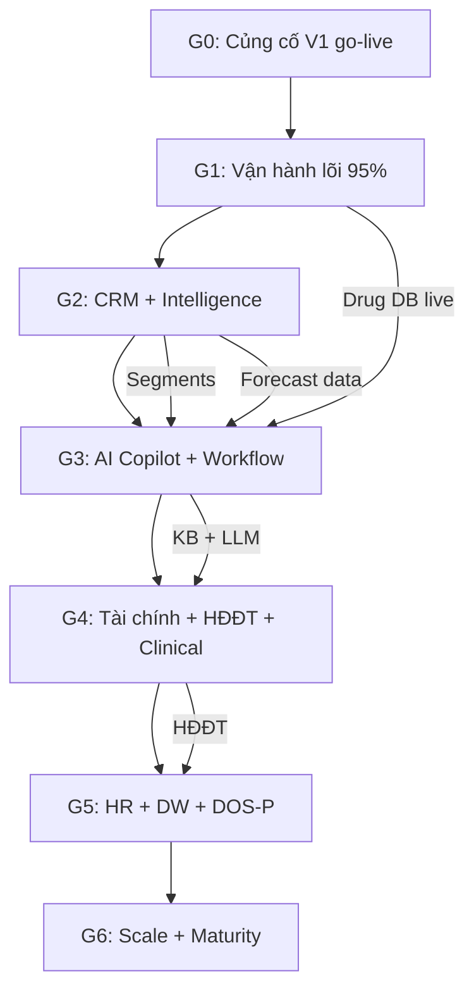

# Novixa — Yêu cầu mục tiêu & Trình tự hoàn thiện

**Mã:** NVX-PRD-08 · **Tier:** T1/T2 · **Trạng thái:** Draft · **Version:** 1.0  
**Ngày:** 2026-07-08 · **Owner:** Product  
**Liên quan:** [module-catalog-v1.md](./module-catalog-v1.md) · [product-overview-v1.md](./product-overview-v1.md) · [enterprise-architecture-gap-matrix-v1.md](../03-solution/enterprise-architecture-gap-matrix-v1.md)

> Tài liệu này ghi lại **toàn bộ yêu cầu Novixa phải đạt** (tầm nhìn Digital Operating System for Pharmacy) và **trình tự hoàn thiện** theo mức ưu tiên, dựa trên hiện trạng Phân hệ Dược trên KIT Platform (2026-07).

**Legend trạng thái hiện tại:** ✅ Đã có · ⚠️ Một phần / Pilot · ❌ Chưa có

---

## 1. Tầm nhìn & mục tiêu Novixa

### 1.1 Mô tả

Novixa là nền tảng SaaS giúp nhà thuốc quản trị toàn diện hoạt động kinh doanh, vận hành và phát triển, **lấy dữ liệu làm trung tâm** và **AI làm động lực** hỗ trợ ra quyết định.

Novixa không chỉ số hóa quy trình hiện có mà hướng tới xây dựng **Digital Operating System for Pharmacy (DOS-P)**, kết nối mọi hoạt động nhà thuốc trên một nền tảng thống nhất.

Nền tảng xây trên **KIT Enterprise Platform**, kế thừa Identity, Workflow, AI, Analytics, Notification, Assessment, Integration…

### 1.2 Mục tiêu chiến lược (8 nhóm)

| # | Mục tiêu | Trạng thái hiện tại |
|---|----------|---------------------|
| 1 | Quản lý tập trung mọi hoạt động trên một hệ thống | ✅ ~85% |
| 2 | Chuẩn hóa quy trình vận hành theo GPP | ⚠️ ~60% |
| 3 | Quản lý hàng hóa, tồn kho và hạn dùng hiệu quả | ✅ ~90% |
| 4 | Quản lý bán hàng và chăm sóc khách hàng | ✅ ~85% |
| 5 | Quản lý tài chính và dòng tiền | ⚠️ ~35% |
| 6 | Quản lý nhân sự và hiệu suất làm việc | ❌ ~25% |
| 7 | Hỗ trợ ra quyết định bằng dữ liệu và AI | ⚠️ ~35% |
| 8 | Tăng doanh thu, giảm chi phí, giảm rủi ro; kho dữ liệu; chuyển đổi số | ⚠️ ~45% |

### 1.3 Chu trình giá trị bắt buộc

```
Thu thập dữ liệu → Chuẩn hóa → Quản trị → Phân tích → AI hỗ trợ quyết định
→ Tự động hóa → Đo lường → Cải tiến liên tục
```

### 1.4 Sáu lớp năng lực giải pháp

| Lớp | Mô tả | Hoàn thành ước tính |
|-----|-------|---------------------|
| **1. Pharmacy Management** | Hàng hóa, kho, bán, mua, KH, tài chính, nhân sự | ~85% |
| **2. Pharmacy Intelligence** | Thu thập, chuẩn hóa, phân tích hiệu quả KD | ~45% |
| **3. AI Copilot** | Trợ lý AI tra cứu, cảnh báo, dự báo, đề xuất | ~25% |
| **4. Customer Engagement** | Vòng đời KH, loyalty, nhắc thuốc, marketing | ~70% |
| **5. Continuous Improvement** | Đánh giá, audit, GPP, cải tiến liên tục | ~65% |
| **6. Open Platform** | API, tích hợp, mở rộng qua KIT kernel | ~40% |

---

## 2. Yêu cầu chi tiết phải đạt (theo domain)

### 2.1 Quản trị doanh nghiệp

| Yêu cầu | Trạng thái |
|---------|-----------|
| Quản lý chuỗi nhà thuốc | ⚠️ Multi-tenant có; thiếu quản lý tập đoàn đa công ty |
| Quản lý chi nhánh | ✅ |
| Quản lý nhân sự | ⚠️ Employee link user; thiếu module HR |
| Phân quyền | ✅ RBAC |
| Quy trình phê duyệt | ⚠️ Workflow engine có; dùng hạn chế |
| Nhật ký hoạt động | ✅ Audit log |
| Dashboard quản trị | ✅ KPI, doanh thu |

### 2.2 Quản lý hàng hóa

| Yêu cầu | Trạng thái |
|---------|-----------|
| Danh mục thuốc | ✅ |
| Danh mục hàng hóa | ✅ |
| Phân loại | ✅ Categories |
| Đơn vị tính | ✅ |
| Barcode | ✅ Multi-barcode, GS1 |
| Lô sản xuất | ✅ Batch |
| Hạn sử dụng | ✅ |
| FEFO / FIFO | ✅ FEFO (`BatchResolver`) |
| Giá vốn | ✅ |
| Giá bán | ✅ |
| Nhà sản xuất | ✅ Brands |
| Nhà cung cấp | ✅ Suppliers (domain mua hàng) |

### 2.3 Quản lý kho

| Yêu cầu | Trạng thái |
|---------|-----------|
| Nhập | ✅ Opening balance, GRN |
| Xuất | ✅ Sales allocation |
| Chuyển kho | ✅ |
| Kiểm kê | ✅ Workflow 4 bước |
| Điều chỉnh | ✅ |
| Tồn kho | ✅ Realtime |
| Cảnh báo tồn | ✅ Low stock |
| Cảnh báo hết hạn | ✅ INV-02, batch expiry |
| Dự báo nhu cầu | ❌ |

### 2.4 Bán hàng (POS)

| Yêu cầu | Trạng thái |
|---------|-----------|
| Bán lẻ | ✅ |
| Bán theo đơn | ✅ O2O draft orders |
| Quét Barcode | ✅ Admin + Staff PWA |
| Khuyến mại | ✅ |
| Voucher | ✅ |
| Chiết khấu | ✅ + manager approval |
| Thanh toán đa phương thức | ✅ |
| In hóa đơn | ✅ Receipt |
| Đổi trả | ✅ |
| Hoàn tiền | ✅ |

### 2.5 Mua hàng

| Yêu cầu | Trạng thái |
|---------|-----------|
| Đề xuất nhập | ⚠️ Low stock gợi ý; thiếu requisition formal |
| Báo giá | ❌ |
| Đơn mua | ✅ PO |
| Nhập hàng | ✅ GRN |
| Công nợ | ✅ Supplier payables |
| Thanh toán | ✅ |
| Đánh giá nhà cung cấp | ❌ |

### 2.6 Khách hàng (CRM)

| Yêu cầu | Trạng thái |
|---------|-----------|
| Hồ sơ khách hàng | ✅ |
| Lịch sử mua hàng | ✅ |
| Điểm thưởng | ✅ Loyalty |
| Thành viên | ✅ |
| Công nợ | ✅ Receivables |
| Chăm sóc khách hàng | ✅ Chat, consent |
| Marketing | ❌ |
| Chiến dịch | ❌ |
| Phân nhóm | ❌ |
| Loyalty nâng cao | ⚠️ Tier/segment automation thiếu |

### 2.7 Chuyên môn dược

| Yêu cầu | Trạng thái |
|---------|-----------|
| Hồ sơ thuốc | ✅ Catalog + drug fields |
| Tra cứu hoạt chất | ✅ |
| Tương tác thuốc | ❌ |
| Dị ứng | ❌ |
| Chống chỉ định | ❌ |
| Liều dùng | ⚠️ Rule-based AI pilot |
| Hướng dẫn sử dụng | ⚠️ Rule-based AI pilot |
| Nhắc uống thuốc | ✅ Reminders + push |
| Hồ sơ điều trị | ⚠️ Health wallet, active meds |
| Ghi chú dispense / tư vấn | ⚠️ API có; UI thiếu |

### 2.8 Tài chính

| Yêu cầu | Trạng thái |
|---------|-----------|
| Thu | ✅ Customer payments |
| Chi | ✅ Supplier payments |
| Công nợ | ✅ AR/AP |
| Doanh thu | ✅ Reports SALES-* |
| Lợi nhuận | ⚠️ Không P&L đầy đủ |
| Chi phí | ❌ |
| Dòng tiền | ❌ |
| Báo cáo tài chính | ❌ Phase 2 |

### 2.9 Nhân sự

| Yêu cầu | Trạng thái |
|---------|-----------|
| Hồ sơ nhân viên | ⚠️ Gắn user |
| Chấm công | ❌ |
| Ca làm | ⚠️ Ca bán hàng có; HR ca thiếu |
| KPI | ❌ |
| Hiệu suất | ❌ |
| Đào tạo | ❌ |
| Đánh giá | ❌ |

### 2.10 Workflow

| Yêu cầu | Trạng thái |
|---------|-----------|
| Quy trình nghiệp vụ | ⚠️ Schema `kit_workflow.*` |
| Phê duyệt | ⚠️ POS discount, kiểm kê |
| Công việc | ❌ |
| Checklist | ⚠️ Kiểm kê, assessment |
| SLA | ❌ |
| Nhắc việc | ❌ Task inbox |

### 2.11 Assessment Platform

| Yêu cầu | Trạng thái |
|---------|-----------|
| Khảo sát | ✅ |
| Checklist | ✅ Assessment template |
| Audit | ⚠️ Maturity survey; thiếu operational audit |
| Inspection | ❌ |
| Đánh giá GPP | ✅ Template V1 |
| Đánh giá chuyển đổi số | ✅ |
| Đánh giá chất lượng | ⚠️ Scoring có |
| AI phân tích kết quả | ⚠️ Scoring; AI insight thiếu |

### 2.12 AI Platform

| Yêu cầu | Trạng thái |
|---------|-----------|
| Chat AI | ⚠️ Rule-based pilot |
| AI Copilot | ⚠️ Customer app `/ai` |
| AI hỏi đáp | ⚠️ DrugKnowledgeRules |
| AI tìm kiếm tri thức | ❌ |
| AI phân tích kinh doanh | ❌ |
| AI dự báo | ❌ |
| AI gợi ý nhập hàng | ❌ |
| AI phát hiện bất thường | ❌ |
| AI đề xuất hành động | ❌ |
| AI sinh báo cáo | ❌ |

### 2.13 Analytics Platform

| Yêu cầu | Trạng thái |
|---------|-----------|
| Dashboard thời gian thực | ✅ |
| KPI | ✅ |
| Heatmap | ❌ |
| Trend Analysis | ⚠️ Wave 1 reports |
| Benchmark | ❌ |
| OLAP | ❌ |
| Drill Down | ⚠️ Một phần |
| So sánh đa chiều | ⚠️ |
| Data Warehouse | ❌ |

### 2.14 Mobile Platform

| Yêu cầu | Trạng thái |
|---------|-----------|
| Ứng dụng chủ nhà thuốc | ⚠️ Admin web responsive |
| Ứng dụng nhân viên | ✅ Staff PWA |
| Ứng dụng khách hàng | ✅ Customer PWA |
| Offline Sync | ⚠️ PWA cache cơ bản |
| Push Notification | ✅ Web Push |

### 2.15 Integration Platform

| Yêu cầu | Trạng thái |
|---------|-----------|
| API | ✅ REST |
| Webhook | ✅ Outbox + CDP |
| Hóa đơn điện tử | ❌ |
| Thanh toán | ❌ |
| SMS | ⚠️ OTP; gateway config |
| Email | ❌ |
| Zalo | ❌ |
| ERP | ❌ |
| CRM | ❌ |
| BI | ❌ |

---

## 3. Trình tự hoàn thiện (theo giai đoạn)

> **Nguyên tắc sắp xếp:** (1) Đóng gap go-live / tuân thủ / cam kết bán hàng → (2) Hoàn thiện vận hành lõi → (3) Intelligence & AI → (4) Mở rộng nền tảng & DOS-P đầy đủ.

Mỗi hạng mục phụ thuộc các hạng mục trước trong cùng giai đoạn hoặc giai đoạn trước.

---

### Giai đoạn 0 — Củng cố V1 (đang pilot) · 0–3 tháng

**Mục tiêu:** Go-live ổn định, truth in labeling, không over-promise.

| STT | Hạng mục | Domain | Phụ thuộc | Deliverable |
|-----|----------|--------|-----------|-------------|
| 0.1 | SMS OTP production gateway | Integration | — | OTP qua gateway thật, config tenant |
| 0.2 | Web Push production ổn định | Integration / Mobile | — | Push nhắc thuốc, thông báo đơn |
| 0.3 | UI ghi chú dispense / tư vấn | Chuyên môn dược | API có sẵn | Staff POS + Admin: dispensing notes |
| 0.4 | Labeling danh mục thuốc QG | Catalog | — | UI ghi rõ mock/tham khảo HOẶC kết nối API |
| 0.5 | Super Admin bootstrap / script | Quản trị | — | Provision tenant, pack, workspace ổn định |
| 0.6 | Go-live checklist & hypercare | Ops | 0.1–0.5 | Onboarding founding customer |

**Kết quả G0:** V1 pilot go-live an toàn, GPP cơ bản (FEFO, audit, consent, dispense note).

---

### Giai đoạn 1 — Hoàn thiện vận hành lõi · 3–6 tháng

**Mục tiêu:** Pharmacy Management ~95%, đủ chuỗi 2–10 cửa.

| STT | Hạng mục | Domain | Phụ thuộc | Deliverable |
|-----|----------|--------|-----------|-------------|
| 1.1 | Kết nối danh mục thuốc QG (QĐ-522) live | Catalog / Integration | 0.4 | `INationalDrugCatalogService` production |
| 1.2 | Workflow phê duyệt PO | Workflow / Mua hàng | — | PO draft → approve → GRN |
| 1.3 | Workflow phê duyệt điều chỉnh giá | Workflow / Catalog | — | Price change approval |
| 1.4 | Đề xuất nhập hàng (requisition) | Mua hàng / Kho | Low stock | Requisition từ cảnh báo tồn |
| 1.5 | Đánh giá nhà cung cấp cơ bản | Mua hàng | PO/GRN history | Rating/score NCC |
| 1.6 | Offline POS cơ bản (Staff PWA) | Mobile / POS | — | Cache catalog + cart khi mất mạng ngắn |
| 1.7 | Báo cáo Wave 2 (mở rộng) | Analytics | Wave 1 | Thêm 5–8 báo cáo vận hành |
| 1.8 | GPP operational checklist | Continuous Improvement | Assessment | Checklist vận hành hàng ngày/tuần |

**Kết quả G1:** ERP nhà thuốc hoàn chỉnh cho chuỗi nhỏ; quy trình mua–kho–bán có phê duyệt.

---

### Giai đoạn 2 — Customer Engagement & Intelligence · 6–9 tháng

**Mục tiêu:** Trọn vòng đời KH + phân tích sâu hơn.

| STT | Hạng mục | Domain | Phụ thuộc | Deliverable |
|-----|----------|--------|-----------|-------------|
| 2.1 | Phân nhóm khách hàng (segment) | CRM | Customer data | Segment theo RFM, hành vi |
| 2.2 | Chiến dịch marketing cơ bản | CRM | 2.1, SMS/Email | Campaign + consent |
| 2.3 | Loyalty tier / hạng thành viên | CRM | Loyalty | Bronze/Silver/Gold… |
| 2.4 | Engagement dashboard nâng cao | Analytics | 2.1 | Funnel, retention, cohort |
| 2.5 | Dự báo nhu cầu / gợi ý reorder | Kho / Intelligence | Sales history | Reorder suggestion |
| 2.6 | Báo cáo P&L operational | Tài chính | Reports | Doanh thu − COGS − chi phí vận hành |
| 2.7 | Event bus nội bộ (platform events) | Open Platform | — | Chuẩn hóa event envelope |
| 2.8 | AI insight trên Assessment | Assessment / AI | Assessment engine | Tóm tắt điểm yếu + gợi ý cải tiến |

**Kết quả G2:** Customer Engagement ~90%; bắt đầu Intelligence layer thực dụng.

---

### Giai đoạn 3 — AI Copilot & Workflow mở rộng · 9–12 tháng

**Mục tiêu:** AI làm động lực hỗ trợ quyết định (không thay dược sĩ).

| STT | Hạng mục | Domain | Phụ thuộc | Deliverable |
|-----|----------|--------|-----------|-------------|
| 3.1 | Knowledge base thuốc (tenant-safe) | AI / Chuyên môn | 1.1 | KB thay static rules |
| 3.2 | AI Copilot v1 (LLM + policy gate) | AI | 3.1, BR-AI | Admin + Staff + Customer ask |
| 3.3 | AI gợi ý nhập hàng | AI / Kho | 2.5 | Đề xuất PO từ forecast |
| 3.4 | AI phát hiện bất thường (sales/stock) | AI / Analytics | Event bus | Alert doanh thu/tồn bất thường |
| 3.5 | AI sinh báo cáo tóm tắt | AI / Analytics | Reports | Narrative report tuần/tháng |
| 3.6 | Workflow designer / task inbox | Workflow | kit_workflow | PO, kiểm kê, chiết khấu, price |
| 3.7 | SLA & nhắc việc | Workflow | 3.6 | Due date, escalation |
| 3.8 | Treatment plan / hồ sơ điều trị | Chuyên môn dược | Health wallet | Plan gắn medication hub |

**Kết quả G3:** AI Copilot ~60%; Workflow dùng rộng; đạt định vị “AI hỗ trợ quyết định”.

---

### Giai đoạn 4 — Tài chính, tích hợp & tuân thủ · 12–18 tháng

**Mục tiêu:** Đóng gap bán hàng doanh nghiệp & tuân thủ.

| STT | Hạng mục | Domain | Phụ thuộc | Deliverable |
|-----|----------|--------|-----------|-------------|
| 4.1 | Tích hợp Hóa đơn điện tử | Integration / Tài chính | POS | HĐĐT sau bán |
| 4.2 | Cổng thanh toán (QR, ví) | Integration / POS | — | Payment gateway |
| 4.3 | Email / Zalo notification | Integration / CRM | 2.2 | Omnichannel notify |
| 4.4 | Dòng tiền operational | Tài chính | AR/AP | Cash flow view |
| 4.5 | Chi phí vận hành cơ bản | Tài chính | — | Expense entry + báo cáo |
| 4.6 | Export kế toán | Tài chính / Integration | 4.1 | CSV/API cho phần mềm KT |
| 4.7 | Clinical: tương tác thuốc (cơ bản) | Chuyên môn dược | 3.1, drug DB | Interaction check tại POS |
| 4.8 | Dị ứng / chống chỉ định (profile KH) | Chuyên môn dược | Customer profile | Allergy on dispense |

**Kết quả G4:** Tài chính ~70%; Integration production-ready; clinical cơ bản.

---

### Giai đoạn 5 — HR, Analytics nâng cao & DOS-P · 18–24 tháng

**Mục tiêu:** Digital Operating System for Pharmacy đầy đủ hơn.

| STT | Hạng mục | Domain | Phụ thuộc | Deliverable |
|-----|----------|--------|-----------|-------------|
| 5.1 | Module HR: hồ sơ NV độc lập | Nhân sự | — | Employee CRUD UI |
| 5.2 | Chấm công | Nhân sự | 5.1 | Attendance |
| 5.3 | KPI & hiệu suất (gắn ca bán) | Nhân sự / Analytics | Shifts, sales | KPI dashboard NV |
| 5.4 | Đào tạo & đánh giá NV | Nhân sự / Assessment | Assessment engine | Training checklist |
| 5.5 | Data Warehouse / OLAP | Analytics | Event bus, history | DW + drill-down |
| 5.6 | Benchmark & heatmap | Analytics | 5.5, multi-tenant anon | So sánh ngành (opt-in) |
| 5.7 | App chủ nhà thuốc (mobile-first) | Mobile | Dashboard, AI | Owner app PWA/native |
| 5.8 | Native iOS/Android (Staff/Customer) | Mobile | PWA mature | Store apps nếu cần |
| 5.9 | ERP / BI connector | Integration | API, DW | Webhook + export chuẩn |
| 5.10 | Quản lý chuỗi đa công ty | Quản trị | Multi-tenant | Org hierarchy |

**Kết quả G5:** DOS-P ~80–85%; đủ 8 mục tiêu chiến lược ở mức vận hành thực tế.

---

### Giai đoạn 6 — Maturity & scale · 24–36 tháng

**Mục tiêu:** Nền tảng scale, liên tục cải tiến.

| STT | Hạng mục | Domain | Deliverable |
|-----|----------|--------|-------------|
| 6.1 | AI dự báo doanh thu / seasonality | AI | Forecast model |
| 6.2 | Closed-loop cải tiến (Assessment → action → measure) | Continuous Improvement | Outcome tracking |
| 6.3 | Policy & Business Rules catalog | Open Platform | NSF policy engine |
| 6.4 | Inspection / audit vận hành GPP định kỳ | Assessment | Scheduled inspection |
| 6.5 | Báo giá NCC (RFQ) | Mua hàng | Quote comparison |
| 6.6 | Internationalization (EN) | Platform | Admin + customer EN |

---

## 4. Sơ đồ phụ thuộc tóm tắt



---

## 5. Ma trận ưu tiên nhanh (P0 / P1 / P2)

| Ưu tiên | Hạng mục | Giai đoạn |
|---------|----------|-----------|
| **P0** | Dispense notes UI, SMS OTP, labeling drug DB, go-live hypercare | G0 |
| **P0** | Danh mục thuốc QG live, PO approval workflow | G1 |
| **P1** | Reorder suggestion, CRM segment/campaign, P&L operational | G2 |
| **P1** | AI Copilot v1, workflow inbox, AI reorder/anomaly | G3 |
| **P2** | HĐĐT, payment gateway, clinical interaction | G4 |
| **P2** | HR module, DW/OLAP, owner mobile app | G5 |

---

## 6. Tiêu chí “đạt yêu cầu Novixa” theo mốc

| Mốc | % tổng thể ước tính | Định nghĩa đạt |
|-----|---------------------|----------------|
| **V1 Pilot (hiện tại)** | ~55–60% | ERP + Care + Assessment go-live |
| **Sau G1** | ~70% | Vận hành lõi trọn, chuỗi 2–10 cửa |
| **Sau G3** | ~78% | AI + Workflow + Intelligence cơ bản |
| **Sau G5** | ~85% | DOS-P thực dụng, 8 mục tiêu chiến lược |
| **Sau G6** | ~90%+ | Scale, benchmark, closed-loop cải tiến |

---

## 7. Ghi chú vận hành

1. **Không over-promise:** Mọi cam kết sales phải khớp cột *Trạng thái* mục 2 và giai đoạn mục 3.
2. **AI không thay dược sĩ:** Clinical decision support luôn có disclaimer và policy gate (BR-AI).
3. **KIT kernel first:** Workflow, AI, Assessment, Integration mở rộng trên kernel — không fork logic trong pack.
4. **Sync:** Cập nhật [module-catalog-v1.md](./module-catalog-v1.md) khi hoàn thành từng giai đoạn.

---

*Owner: Product · Review: mỗi quý hoặc sau mỗi giai đoạn go-live*
