# TÀI LIỆU MÔ TẢ CHỨC NĂNG PHẦN MỀM NOVIXA

**Software Functional Specification (SFS)**

| | |
|---|---|
| **Mã tài liệu** | NVX-CQD-SFS-01 |
| **Phiên bản** | 1.0 |
| **Sản phẩm** | Novixa Pharmacy Management System |
| **Đơn vị phát triển** | Công ty TNHH Truyền thông và Công nghệ KIT |
| **Phục vụ** | Đăng ký kết nối và liên thông dữ liệu với Cục Quản lý Dược |
| **Ngày ban hành** | 10/07/2026 |

---

## Mục lục

1. [Giới thiệu](#1-giới-thiệu)
2. [Phạm vi và đối tượng sử dụng](#2-phạm-vi-và-đối-tượng-sử-dụng)
3. [Các chức năng chính](#3-các-chức-năng-chính)
4. [Chức năng liên thông Cục Quản lý Dược](#4-chức-năng-liên-thông-cục-quản-lý-dược)
5. [Quy trình nghiệp vụ liên quan liên thông](#5-quy-trình-nghiệp-vụ-liên-quan-liên-thông)
6. [Yêu cầu dữ liệu đầu ra theo QĐ 540](#6-yêu-cầu-dữ-liệu-đầu-ra-theo-qđ-540)
7. [Nhật ký giao dịch và theo dõi trạng thái](#7-nhật-ký-giao-dịch-và-theo-dõi-trạng-thái)
8. [Xử lý lỗi và gửi lại](#8-xử-l-lỗi-và-gửi-lại)
9. [Bảo mật và tuân thủ GPP](#9-bảo-mật-và-tuân-thủ-gpp)
10. [Hình ảnh giao diện minh họa](#10-hình-ảnh-giao-diện-minh-họa)
11. [Phụ lục](#11-phụ-lục)

---

## 1. Giới thiệu

### 1.1 Tổng quan sản phẩm

**Novixa** là nền tảng quản trị nhà thuốc được phát triển dành cho các nhà thuốc và chuỗi nhà thuốc tại Việt Nam, xây dựng trên nền tảng kỹ thuật **KIT Platform** (KitPlatform).

Hệ thống hỗ trợ quản lý toàn diện hoạt động kinh doanh, tồn kho theo lô và hạn dùng (FEFO), khách hàng, báo cáo tuân thủ GPP và **kết nối, liên thông dữ liệu** với **Hệ thống dược quốc gia** (CSDL Dược Quốc gia) theo quy định của Cục Quản lý Dược — Bộ Y tế.

### 1.2 Thành phần phần mềm

| Thành phần | Mô tả | Người dùng |
|------------|-------|------------|
| **Admin Web** | ERP quản trị, POS desktop | Chủ nhà thuốc, quản lý, dược sĩ |
| **Staff POS Mobile** | Ứng dụng bán hàng di động (PWA) | Thu ngân, dược sĩ quầy |
| **Customer App** | Ứng dụng khách hàng (PWA) | Khách mua thuốc |
| **KitPlatform API** | REST API backend | Ứng dụng nội bộ, connector liên thông |
| **Drug Integration Service** | Module xuất và đồng bộ dữ liệu QĐ 540 | Hệ thống tự động |

### 1.3 Căn cứ pháp lý

Phần mềm được thiết kế tuân thủ:

- **Quyết định 540/QĐ-QLD** — Chuẩn yêu cầu dữ liệu đầu ra phần mềm kết nối liên thông cơ sở bán lẻ thuốc (Bảng 1: mua/bán/tồn)
- **Quyết định 522/QĐ-BYT** — Danh mục thuốc CSDL Dược Quốc gia
- **Quyết định 777/QĐ-QLD** — Quy định kết nối liên thông
- **Thông tư 07/2018/TT-BYT** — Thực hành tốt nhà thuốc (GPP)
- **Nghị định 54/2017/NĐ-CP** — Quy định về đơn vị tính thuốc

---

## 2. Phạm vi và đối tượng sử dụng

### 2.1 Phạm vi

Tài liệu này mô tả **chức năng nghiệp vụ** của Novixa và **khả năng liên thông** với Cục Quản lý Dược, bao gồm:

- Quản lý bán hàng, danh mục thuốc, kho, khách hàng, báo cáo
- Đồng bộ danh mục thuốc từ CSDL Dược Quốc gia
- Xuất và truyền dữ liệu mua/bán/tồn theo chuẩn QĐ 540 Bảng 1
- Theo dõi trạng thái gửi dữ liệu, nhật ký đồng bộ

**Ngoài phạm vi v1.0:** Bảng 2–4 QĐ 540, Bảng 3 đơn thuốc (QĐ 228) — nằm trong lộ trình phát triển.

### 2.2 Đối tượng sử dụng

| Vai trò | Quyền hạn chính |
|---------|-----------------|
| **Chủ nhà thuốc / Admin** | Toàn quyền cấu hình, báo cáo, liên thông |
| **Dược sĩ / Quản lý** | Danh mục, kho, bán thuốc kê đơn, xuất liên thông |
| **Thu ngân** | POS bán hàng, ca làm việc |
| **Hệ thống (tự động)** | Connector đồng bộ theo lịch |

---

## 3. Các chức năng chính

### 3.1 Quản lý bán hàng (POS)

**Mục đích:** Hỗ trợ bán thuốc tại quầy, ghi nhận giao dịch phục vụ liên thông.

| Chức năng | Mô tả |
|-----------|-------|
| Bán thuốc tại quầy | Tạo đơn bán, chọn sản phẩm, số lượng |
| Quét Barcode | Tra cứu nhanh sản phẩm qua mã vạch |
| Tra cứu thuốc | Tìm theo tên, mã, hoạt chất |
| Bán theo đơn thuốc | Liên kết đơn thuốc điện tử (E-Rx) |
| Xuất hóa đơn | In bill, cấu hình mẫu hóa đơn |
| Thanh toán nhiều hình thức | Tiền mặt, chuyển khoản, công nợ |
| Phân bổ lô FEFO | Tự động chọn lô hết hạn trước |
| Đồng bộ tồn kho | Trừ tồn theo lô khi hoàn tất đơn |
| Lưu lịch sử bán hàng | Lưu trữ vĩnh viễn, phục vụ báo cáo và liên thông |
| Quản lý ca làm việc | Mở/đóng ca, đối soát doanh thu |
| Trả hàng | Ghi nhận trả hàng, điều chỉnh tồn |

> **Hình ảnh:** *Screenshot POS Dashboard* — xem [Mục 10](#10-hình-ảnh-giao-diện-minh-họa)

**Dữ liệu phục vụ liên thông:** Mỗi dòng bán hoàn tất (`sales_orders.status = Completed`) sinh bản ghi xuất QĐ 540 với `so_luong_ban`, `ngay_ban`, thông tin lô và thuốc.

---

### 3.2 Quản lý thuốc (Danh mục)

**Mục đích:** Quản lý master data thuốc, liên kết mã CSDL Dược Quốc gia.

| Hạng mục | Mô tả |
|----------|-------|
| Danh mục thuốc | Mã SP, tên thuốc, phân loại |
| Hoạt chất | Liên kết hoạt chất, nồng độ/hàm lượng |
| Nhóm thuốc | Phân loại theo nhóm điều trị |
| Đơn vị tính | ĐVT bán, ĐVT nhỏ nhất (NĐ 54/2017) |
| Nhà sản xuất | Thương hiệu, quốc gia sản xuất |
| Nhà cung cấp | NCC bán buôn, mã cơ sở bán buôn |
| Thuốc kê đơn / không kê đơn | Phân loại theo quy định |
| **Liên kết CSDL Dược QG** | `national_drug_id` (mã thuốc), `national_registration_number` (số đăng ký) |
| Tra cứu danh mục QG | Tìm kiếm, prefill sản phẩm từ CSDL Dược Quốc gia |
| Liên kết hàng loạt | Gợi ý SĐK, bulk-link mã QG |

> **Hình ảnh:** *Screenshot Drug Master / Tra cứu CSDL Dược QG*

**Trường QĐ 540 trên sản phẩm:** `ma_thuoc`, `ten_thuoc`, `so_dang_ky`, `ten_hoat_chat`, `nong_do_ham_luong`, `nha_san_xuat`, `nuoc_san_xuat`, `nha_nhap_khau`, `quy_cach_dong_goi`, `dang_bao_che`, `don_vi_dong_goi_nn`.

---

### 3.3 Quản lý kho FEFO

**Mục đích:** Quản lý tồn kho theo lô, hạn dùng — nguồn dữ liệu cho `so_luong_ton`, `so_lo`, `han_dung`.

| Chức năng | Mô tả |
|-----------|-------|
| Quản lý nhập kho | Phiếu nhập kho (GRN) từ NCC |
| Quản lý xuất kho | Xuất qua bán hàng, điều chỉnh |
| Theo dõi lô | `batch_number` trên từng lô |
| Theo dõi hạn dùng | `expiry_date`, cảnh báo cận hạn |
| FEFO | First Expired, First Out — ưu tiên lô hết hạn sớm |
| Kiểm kê | Phiên kiểm kê, điều chỉnh chênh lệch |
| Điều chỉnh kho | Tăng/giảm tồn có phê duyệt |
| Chuyển kho | Chuyển lô giữa kho/chi nhánh |
| Sổ cái tồn kho | `stock_movements` — nguồn sự thật |

> **Hình ảnh:** *Screenshot Inventory / FEFO*

**Dữ liệu phục vụ liên thông:** Mỗi dòng GRN hoàn tất sinh bản ghi với `so_luong_nhap`, `ngay_nhap`, `so_hoa_don_mthuoc`, `Ma_co_so_ban_buon`.

---

### 3.4 Quản lý khách hàng

| Chức năng | Mô tả |
|-----------|-------|
| Hồ sơ khách hàng | Thông tin liên hệ, lịch sử |
| Lịch sử mua thuốc | Tra cứu theo khách |
| Điểm thưởng / Loyalty | Tích điểm, đổi quà |
| Công nợ | Quản lý nợ khách hàng |
| CRM | Phân khúc, chăm sóc khách |

> **Hình ảnh:** *Screenshot CRM*

*Lưu ý: Dữ liệu khách hàng cá nhân không truyền lên CSDL Dược QG trong phạm vi QĐ 540 Bảng 1.*

---

### 3.5 Dashboard

Theo dõi trực quan:

| Chỉ số | Mô tả |
|--------|-------|
| Doanh thu | Theo ngày/tuần/tháng |
| Lợi nhuận | Biên lợi nhuận gộp |
| KPI | Chỉ tiêu vận hành |
| Tồn kho | Giá trị tồn, số SKU |
| Hàng cận hạn | Cảnh báo lô sắp hết HSD |
| Hàng bán chạy | Top sản phẩm |
| Hiệu suất nhân viên | Doanh thu theo ca/nhân viên |

> **Hình ảnh:** *Screenshot Dashboard*

---

### 3.6 Báo cáo

| Báo cáo | Mô tả |
|---------|-------|
| Báo cáo bán hàng | Doanh thu theo kỳ, ca, phương thức |
| Báo cáo tồn kho | Snapshot tồn theo lô |
| Báo cáo nhập — xuất — tồn | Biến động kho |
| Báo cáo hàng cận hạn | Lô sắp/đã hết HSD |
| Báo cáo doanh thu | Phân tích doanh thu |
| Báo cáo khách hàng | Phân tích CRM |
| Báo cáo GPP | Checklist tuân thủ GPP |

> **Hình ảnh:** *Screenshot Reports*

---

## 4. Chức năng liên thông Cục Quản lý Dược

Hệ thống hỗ trợ **liên thông dữ liệu** với Hệ thống dược quốc gia theo quy định của Bộ Y tế thông qua module **Drug Integration Service**.

### 4.1 Tổng quan chức năng liên thông

| STT | Chức năng | Mô tả |
|-----|-----------|-------|
| 1 | **Đồng bộ danh mục thuốc** | Tra cứu CSDL Dược QG (QĐ 522), liên kết `ma_thuoc`, `so_dang_ky`, hoạt chất, ĐVT, NSX |
| 2 | **Đồng bộ giao dịch bán thuốc** | Truyền thông tin hóa đơn, thời gian bán, thuốc, số lượng, lô, mã cơ sở bán lẻ |
| 3 | **Đồng bộ dữ liệu nhập thuốc** | Truyền NCC, phiếu nhập, lô, hạn dùng, số HĐ GTGT, mã cơ sở bán buôn |
| 4 | **Đồng bộ dữ liệu tồn kho** | Số lượng tồn theo lô, theo hạn dùng (snapshot) |
| 5 | **Theo dõi trạng thái gửi** | Chưa gửi → Đang gửi → Thành công / Thất bại → Gửi lại |
| 6 | **Nhật ký đồng bộ** | Lưu request/response, thời gian, người gửi, trạng thái |
| 7 | **Xuất kiểm thử QĐ 540** | JSON/CSV 23 trường Bảng 1 trước khi kết nối Live |

> **Hình ảnh:** *Screenshot Drug Connectivity / QĐ 540 Export*

### 4.2 Đồng bộ danh mục thuốc (QĐ 522)

**Luồng nghiệp vụ:**

1. Dược sĩ tra cứu thuốc trên CSDL Dược Quốc gia
2. Hệ thống hiển thị: mã thuốc, tên, SĐK, hoạt chất, NSX, dạng bào chế, quy cách
3. Người dùng chọn "Tạo sản phẩm từ QG" — hệ thống prefill danh mục nội bộ
4. Sản phẩm được gán `national_drug_id` và `national_registration_number`

**Chế độ kết nối:**

| Mode | Mô tả |
|------|-------|
| `mock` | Dữ liệu mẫu — phát triển/kiểm thử |
| `sandbox` | Môi trường thử nghiệm CSDL Dược QG |
| `live` | Kết nối production CSDL Dược QG |

### 4.3 Đồng bộ giao dịch bán thuốc

**Nguồn dữ liệu:** `sales_orders` (trạng thái Hoàn tất) → `sales_order_items` → `inventory_batches`

**Dữ liệu truyền (QĐ 540):**

- Thông tin thuốc: `ma_thuoc`, `ten_thuoc`, `so_dang_ky`, …
- Giao dịch: `so_luong_ban`, `gia_ban_le`, `ngay_ban`
- Lô: `so_lo`, `han_dung`
- Cơ sở: `Ma_co_so_ban_le`

### 4.4 Đồng bộ dữ liệu nhập thuốc

**Nguồn dữ liệu:** `goods_receipts` (GRN hoàn tất) → `goods_receipt_items` → `suppliers`

**Dữ liệu truyền:**

- NCC: `don_vi_bthuoc_cho_csbl`, `Ma_co_so_ban_buon`
- Chứng từ: `so_hoa_don_mthuoc`
- Nhập: `so_luong_nhap`, `ngay_nhap`
- Lô: `so_lo`, `han_dung`

### 4.5 Đồng bộ dữ liệu tồn kho

**Nguồn:** `inventory_batches.quantity_available` quy về ĐVT nhỏ nhất

**Grain snapshot:** Cuối ngày hoặc theo lịch đồng bộ — `so_luong_ton` trên từng lô.

### 4.6 Theo dõi trạng thái gửi dữ liệu

| Trạng thái | Mô tả | Hành động |
|------------|-------|-----------|
| **Chưa gửi** | Dữ liệu mới, chưa vào hàng đợi | Tự động enqueue theo lịch |
| **Đang gửi** | Đang truyền lên Cổng liên thông | Chờ phản hồi |
| **Thành công** | Cục QLD xác nhận nhận | Ghi log, không gửi lại |
| **Thất bại** | Lỗi mạng, validation, timeout | Retry tự động / gửi lại thủ công |

---

## 5. Quy trình nghiệp vụ liên quan liên thông

### 5.1 Quy trình thiết lập liên thông (lần đầu)

```
1. Nhà thuốc đăng ký mã cơ sở bán lẻ (Ma_co_so_ban_le) tại Cục QLD
2. Admin Novixa nhập mã cơ sở vào cấu hình Chi nhánh
3. Admin nhập mã cơ sở bán buôn (Ma_co_so_ban_buon) cho từng NCC
4. Liên kết danh mục thuốc với CSDL Dược QG
5. Kiểm thử xuất QĐ 540 (JSON/CSV) — xác minh 23 trường
6. Kích hoạt connector Live — đồng bộ tự động theo lịch
```

### 5.2 Quy trình vận hành hàng ngày

```
Nhập thuốc (GRN) ──→ Ghi nhận lô, HĐ GTGT
        │
        ▼
Bán thuốc (POS) ──→ Trừ tồn FEFO, hoàn tất đơn
        │
        ▼
Drug Integration Service ──→ Transform QĐ 540
        │
        ▼
Hàng đợi gửi ──→ Cổng liên thông BYT ──→ Cục QLD
        │
        ▼
Nhật ký + cảnh báo lỗi (nếu có)
```

---

## 6. Yêu cầu dữ liệu đầu ra theo QĐ 540

Phần mềm xuất **Bảng 1** gồm **23 trường** theo QĐ 540/QĐ-QLD:

| STT | Trường | Kiểu | Mô tả |
|-----|--------|------|-------|
| 1 | `ma_thuoc` | Chuỗi 50 | Mã thuốc CSDL Dược QG |
| 2 | `ten_thuoc` | Chuỗi 50 | Tên thuốc |
| 3 | `so_dang_ky` | Chuỗi 20 | Số đăng ký lưu hành |
| 4 | `ten_hoat_chat` | Chuỗi 50 | Tên hoạt chất |
| 5 | `nong_do_ham_luong` | Chuỗi 20 | Nồng độ/hàm lượng |
| 6 | `nha_san_xuat` | Chuỗi 100 | Nhà sản xuất |
| 7 | `nuoc_san_xuat` | Chuỗi 20 | Nước sản xuất |
| 8 | `nha_nhap_khau` | Chuỗi 100 | Nhà nhập khẩu |
| 9 | `quy_cach_dong_goi` | Chuỗi 20 | Quy cách đóng gói |
| 10 | `dang_bao_che` | Chuỗi 20 | Dạng bào chế |
| 11 | `don_vi_dong_goi_nn` | Chuỗi 20 | ĐVT nhỏ nhất |
| 12 | `gia_ban_le` | Số 10 | Giá bán lẻ (VND) |
| 13 | `so_lo` | Chuỗi 20 | Số lô |
| 14 | `han_dung` | Số 8 | Hạn dùng (YYYYMMDD) |
| 15 | `so_luong_nhap` | Số | Số lượng nhập |
| 16 | `so_luong_ban` | Số | Số lượng bán |
| 17 | `so_luong_ton` | Số | Số lượng tồn |
| 18 | `don_vi_bthuoc_cho_csbl` | Chuỗi 100 | ĐV bán buôn cung cấp |
| 19 | `so_hoa_don_mthuoc` | Chuỗi 20 | Số HĐ GTGT mua thuốc |
| 20 | `ngay_nhap` | Số 12 | Ngày nhập (YYYYMMDDHHmm) |
| 21 | `ngay_ban` | Số 12 | Ngày bán (YYYYMMDDHHmm) |
| 22 | `Ma_co_so_ban_le` | Chuỗi 12 | Mã cơ sở bán lẻ |
| 23 | `Ma_co_so_ban_buon` | Chuỗi 12 | Mã cơ sở bán buôn |

**Validation trước export:**

- Thiếu `Ma_co_so_ban_le` → **Chặn** export chi nhánh
- Thiếu hạn dùng lô → **Chặn** dòng
- Thiếu `so_dang_ky` → **Cảnh báo**
- Đơn nháp / GRN nháp → **Loại** khỏi export

Chi tiết map trường: xem [Phụ lục A — QĐ 540 Field Map](./phu-luc-a-qd540-field-map-v1.md).

---

## 7. Nhật ký giao dịch và theo dõi trạng thái

### 7.1 Nội dung nhật ký

Hệ thống lưu trữ đầy đủ trong bảng `qd540_export_log` và audit log:

| Trường | Mô tả |
|--------|-------|
| Request | Payload JSON gửi đi |
| Response | Phản hồi từ Cổng liên thông |
| Thời gian | Timestamp UTC + múi giờ VN |
| Người gửi | User ID hoặc `system` (tự động) |
| IP | Địa chỉ IP nguồn gửi |
| Token | Reference token (không lưu plaintext) |
| Trạng thái | success / failed / pending |
| Số dòng | `row_count` |
| Hash payload | `payload_hash` — phát hiện trùng lặp |

### 7.2 Giao diện theo dõi

Màn hình **Liên thông Cục QLD** hiển thị:

- Danh sách lần export theo kỳ
- Cảnh báo thiếu dữ liệu (mã cơ sở, SĐK, HSD)
- Lịch sử gửi với filter theo trạng thái
- Nút "Gửi lại" cho bản ghi thất bại

> **Hình ảnh:** *Screenshot Sync Log*

---

## 8. Xử lý lỗi và gửi lại

| Cơ chế | Mô tả |
|--------|-------|
| **Retry tự động** | Exponential backoff: 1 phút → 5 phút → 15 phút → 1 giờ (tối đa 5 lần) |
| **Queue gửi lại** | Hàng đợi persistent (Integration Outbox) |
| **Ghi log** | Mọi lỗi ghi vào `qd540_export_log.error_message` |
| **Thông báo lỗi** | Cảnh báo trên Admin UI + email (tùy cấu hình) |
| **Theo dõi lịch sử** | Tra cứu theo kỳ, chi nhánh, trạng thái |
| **Idempotent** | `payload_hash` tránh gửi trùng |

**Mã lỗi thường gặp:**

| Mã | Mô tả | Xử lý |
|----|-------|-------|
| `MISSING_RETAIL_CODE` | Thiếu mã cơ sở bán lẻ | Cập nhật Chi nhánh |
| `MISSING_EXPIRY` | Thiếu hạn dùng lô | Bổ sung trên lô kho |
| `MISSING_REGISTRATION` | Thiếu số đăng ký | Liên kết CSDL Dược QG |
| `VALIDATION_FAILED` | Dữ liệu không đạt chuẩn 540 | Sửa master data |
| `NETWORK_ERROR` | Lỗi kết nối | Retry tự động |
| `AUTH_FAILED` | Token hết hạn | Refresh token, gửi lại |

---

## 9. Bảo mật và tuân thủ GPP

### 9.1 Bảo mật hệ thống

| Hạng mục | Triển khai |
|----------|------------|
| **HTTPS/TLS 1.2+** | Mọi kết nối API và liên thông |
| **JWT Authentication** | Access token + refresh token |
| **RBAC** | Phân quyền theo vai trò (Catalog, Inventory, Sales, Integration) |
| **Audit Log** | Ghi mọi thao tác quan trọng |
| **Mã hóa dữ liệu** | PostgreSQL at-rest, bcrypt password |
| **Backup định kỳ** | Snapshot DB hàng ngày |
| **Multi-tenant isolation** | `tenant_id` trên mọi bảng nghiệp vụ |
| **CORS whitelist** | Chỉ domain Novixa được phép |

### 9.2 Tuân thủ GPP

- Checklist GPP tích hợp trong module Inventory
- Quy trình bán thuốc kê đơn theo TT 07/2018
- Lưu trữ lịch sử bán thuốc kê đơn
- Cảnh báo thuốc cận hạn, thuốc hết hạn

---

## 10. Hình ảnh giao diện minh họa

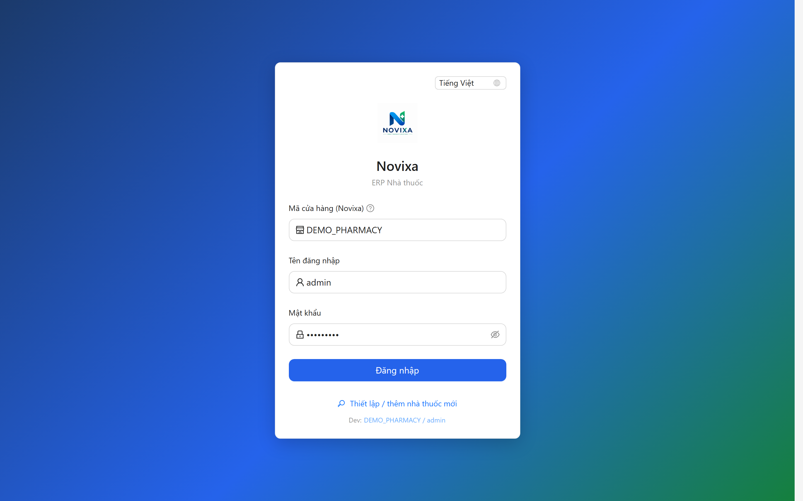

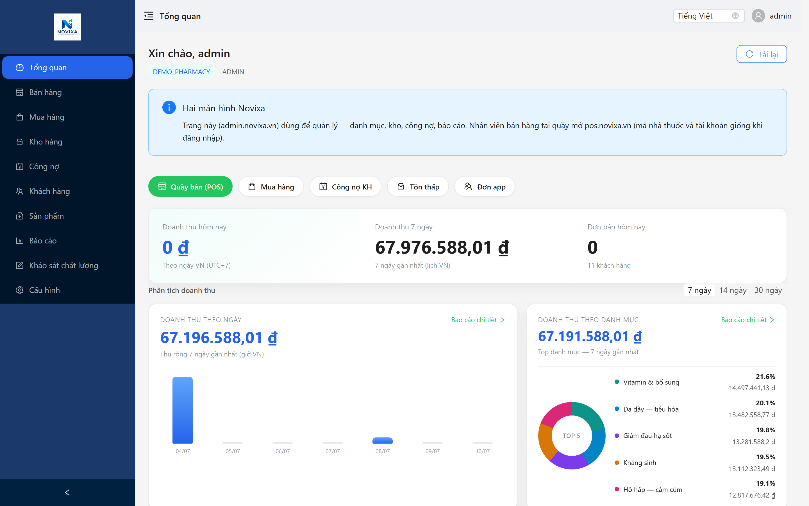

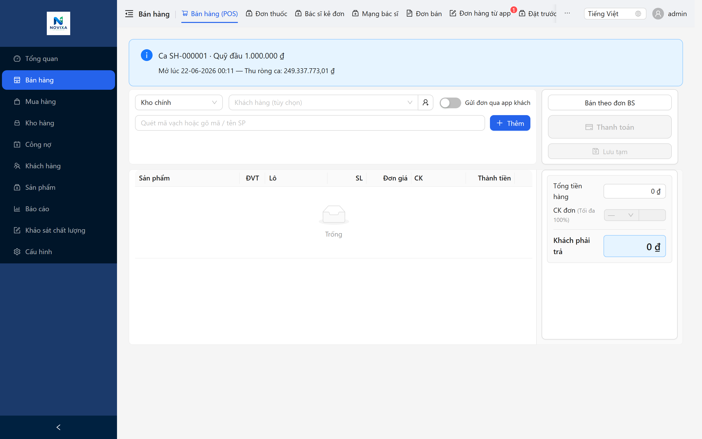

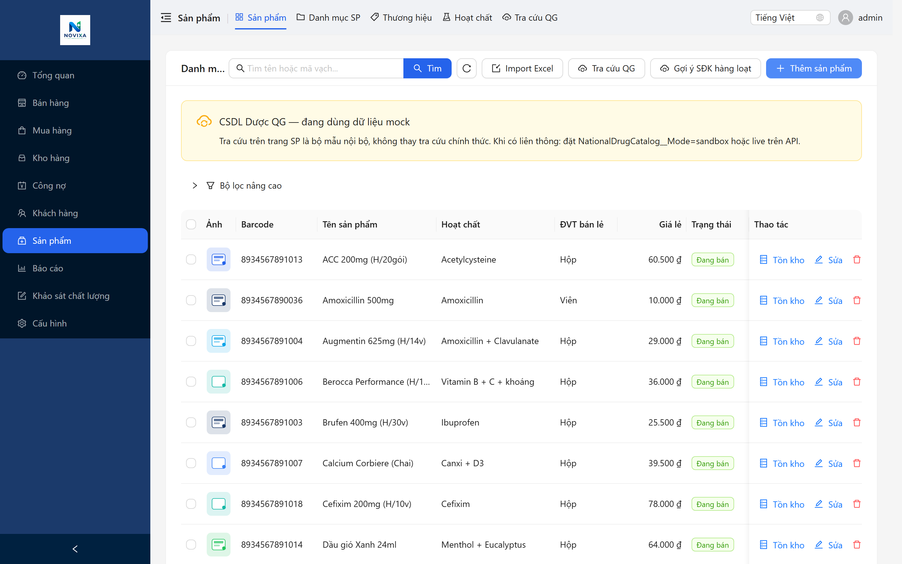

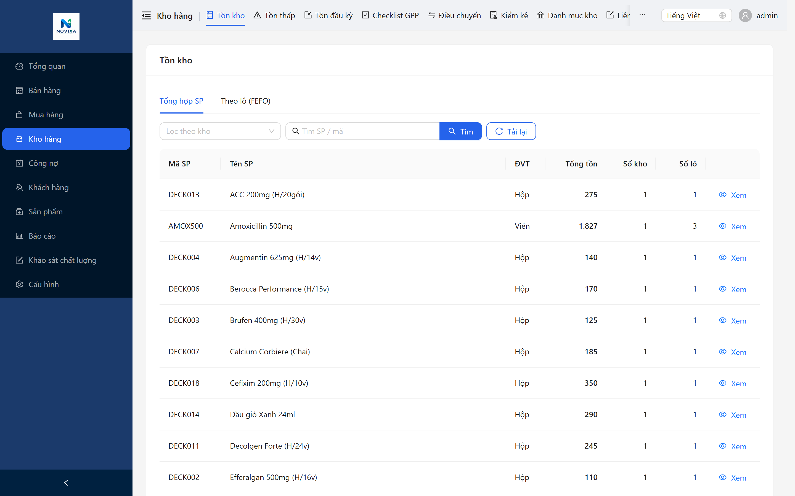

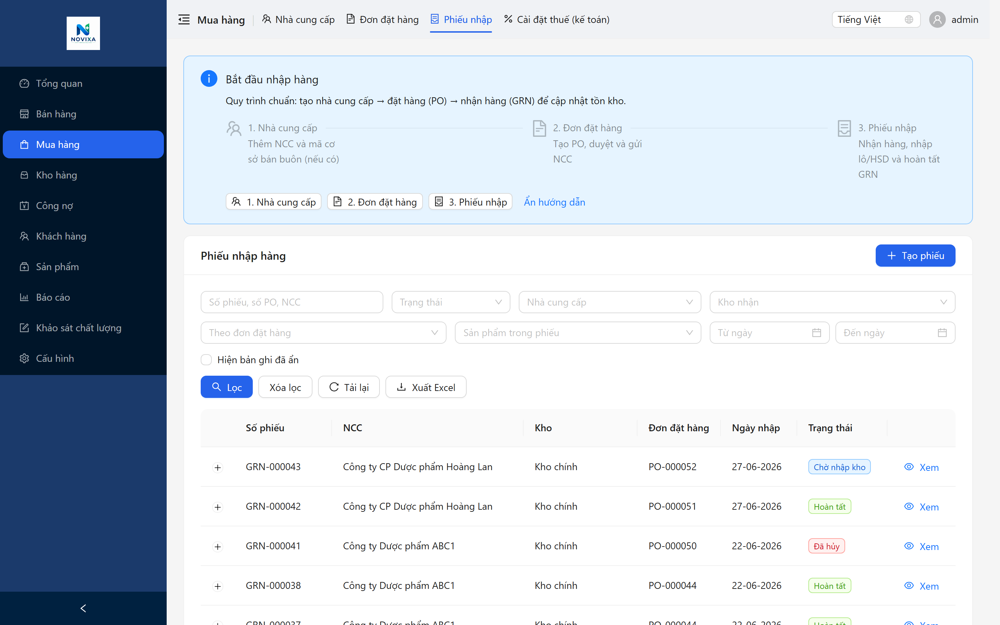

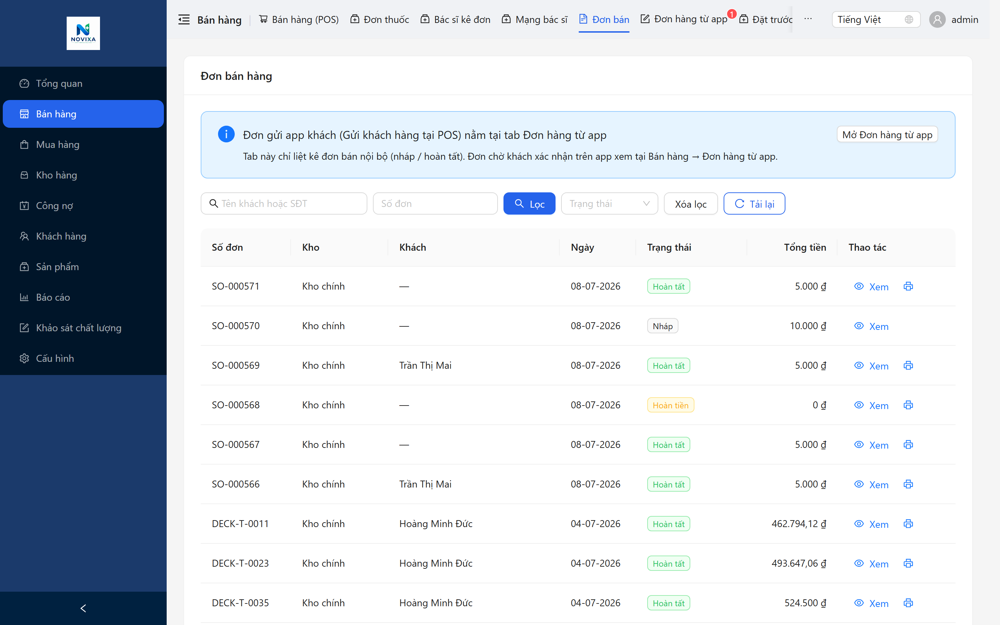

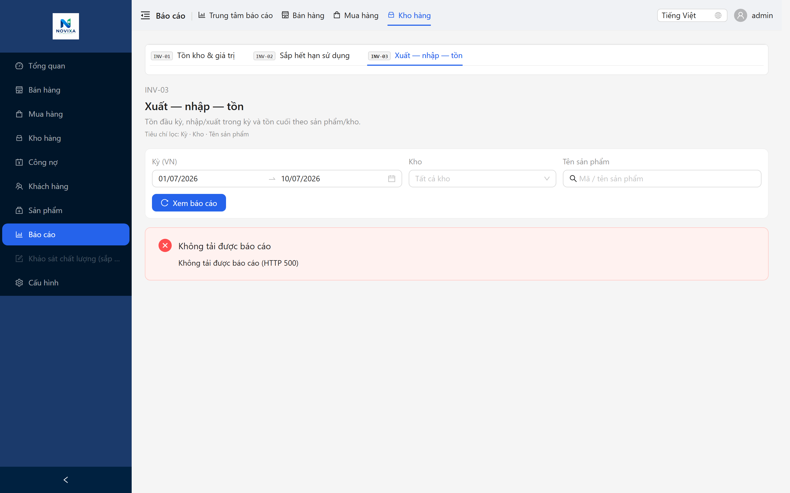

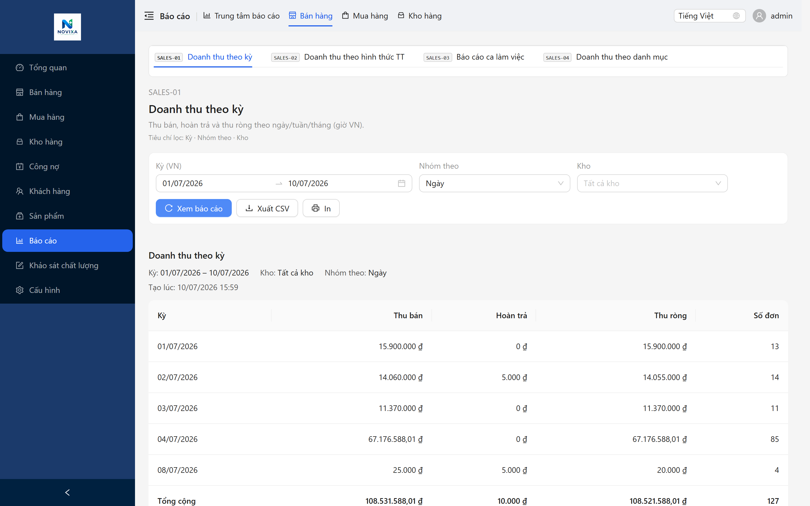


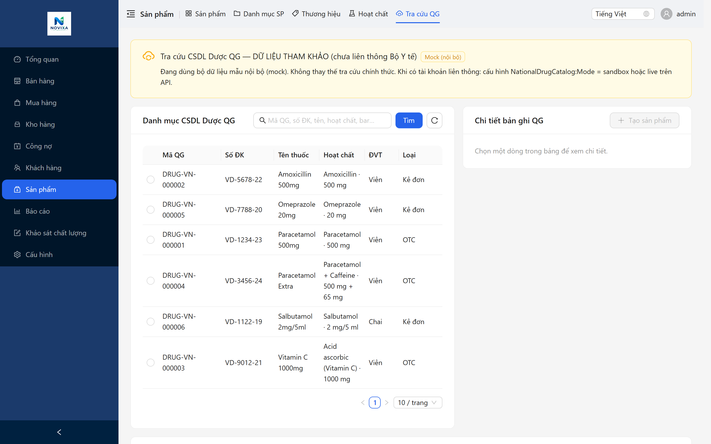

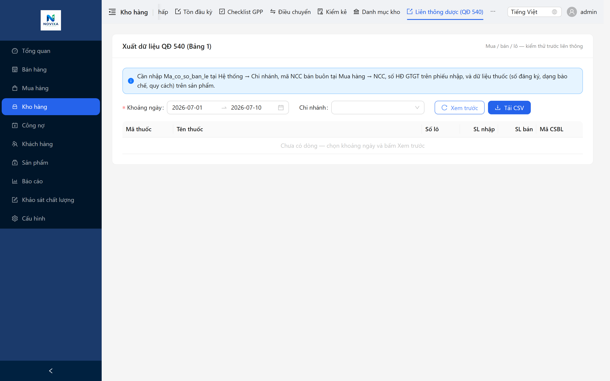

| STT | Màn hình | File |
|-----|----------|------|
| 1 | Đăng nhập | `01-login.png` |
| 2 | Dashboard tổng quan | `02-dashboard.png` |
| 3 | POS bán hàng | `03-pos.png` |
| 4 | Danh mục thuốc | `04-drug-master.png` |
| 5 | Quản lý kho FEFO | `05-inventory.png` |
| 6 | Nhập thuốc (GRN) | `06-grn.png` |
| 7 | Bán thuốc | `07-sale.png` |
| 8 | Báo cáo N-X-T | `08-report-nxt.png` |
| 9 | Báo cáo doanh thu | `09-report-revenue.png` |
| 10 | Liên thông Cục QLD | `10-drug-connectivity.png` |
| 11 | Cấu hình API | `11-api-config.png` |
| 12 | Nhật ký đồng bộ | `12-sync-log.png` |

---

## 11. Phụ lục

### Phụ lục A — Map trường QĐ 540

Chi tiết: [`phu-luc-a-qd540-field-map-v1.md`](./phu-luc-a-qd540-field-map-v1.md)

### Phụ lục B — Module catalog

Chi tiết: [`docs/novixa/02-product/module-catalog-v1.md`](../../02-product/module-catalog-v1.md)

### Phụ lục C — GPP operational context

Chi tiết: [`docs/novixa/06-compliance/gpp-operational-context-v1.md`](../gpp-operational-context-v1.md)

---

**Công ty TNHH Truyền thông và Công nghệ KIT**  
*Novixa Pharmacy Management System — Phiên bản 1.0*
