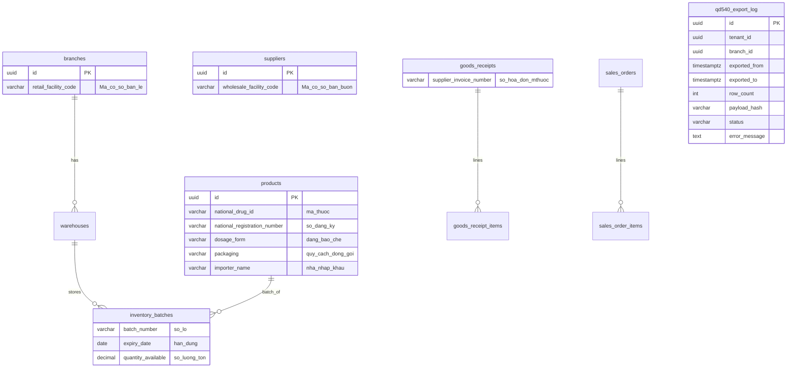

# TÀI LIỆU KIẾN TRÚC HỆ THỐNG NOVIXA

**System Architecture Document — Liên thông Cục Quản lý Dược**

| | |
|---|---|
| **Mã tài liệu** | NVX-CQD-ARCH-01 |
| **Phiên bản** | 1.0 |
| **Sản phẩm** | Novixa Pharmacy Management System |
| **Đơn vị phát triển** | Công ty TNHH Truyền thông và Công nghệ KIT |
| **Ngày ban hành** | 10/07/2026 |

---

## Mục lục

1. [Tổng quan kiến trúc](#1-tổng-quan-kiến-trúc)
2. [Sơ đồ liên thông tổng thể](#2-sơ-đồ-liên-thông-tổng-thể)
3. [Thành phần hệ thống](#3-thành-phần-hệ-thống)
4. [Kiến trúc Drug Integration Service](#4-kiến-trúc-drug-integration-service)
5. [Luồng dữ liệu nghiệp vụ](#5-luồng-dữ-liệu-nghiệp-vụ)
6. [Mô hình dữ liệu liên thông](#6-mô-hình-dữ-liệu-liên-thông)
7. [Triển khai và hạ tầng](#7-triển-khai-và-hạ-tầng)
8. [Bảo mật kiến trúc](#8-bảo-mật-kiến-trúc)
9. [Khả năng mở rộng và độ sẵn sàng](#9-khả-năng-mở-rộng-và-độ-sẵn-sàng)
10. [Lộ trình kết nối Live](#10-lộ-trình-kết-nối-live)

---

## 1. Tổng quan kiến trúc

### 1.1 Nguyên tắc thiết kế

Novixa được xây dựng trên **KIT Platform** — nền tảng SaaS multi-tenant với kiến trúc **Modular Monolith** và mô hình **Solution Pack**:

| Nguyên tắc | Mô tả |
|------------|-------|
| **Multi-tenant** | Một instance phục vụ nhiều nhà thuốc, cô lập bằng `tenant_id` |
| **Modular Monolith** | Lõi platform + pack nghiệp vụ (Pharmacy, Clinic, Survey) |
| **Clean Architecture** | Application → Infrastructure → API (dependency inversion) |
| **Event-driven sync** | Integration Outbox pattern cho liên thông bất đồng bộ |
| **FEFO inventory** | Tồn kho theo lô, hết hạn trước — nguồn sự thật cho QĐ 540 |

### 1.2 Stack công nghệ

| Layer | Công nghệ | Phiên bản |
|-------|-----------|-----------|
| **Backend API** | ASP.NET Core | .NET 10 |
| **Database** | PostgreSQL | 16+ |
| **Admin Web** | React, Ant Design, Vite | React 18 |
| **Staff POS** | React PWA | Mobile-first |
| **Customer App** | React PWA | O2O, loyalty |
| **Reverse Proxy** | Nginx | TLS termination |
| **Hosting** | VPS Ubuntu | 24.04 LTS |

---

## 2. Sơ đồ liên thông tổng thể

### 2.1 Sơ đồ kiến trúc liên thông

```
┌─────────────────────────────────────────────────────────────────────────┐
│                        NOVIXA (Cơ sở bán lẻ thuốc)                      │
│                                                                         │
│  ┌──────────────┐  ┌──────────────┐  ┌──────────────┐                  │
│  │  Admin Web   │  │  Staff POS   │  │ Customer App │                  │
│  │ admin.novixa │  │ pos.novixa   │  │ app.novixa   │                  │
│  └──────┬───────┘  └──────┬───────┘  └──────┬───────┘                  │
│         │                 │                 │                           │
│         └─────────────────┼─────────────────┘                           │
│                           │ HTTPS / JWT                                 │
│                           ▼                                             │
│  ┌─────────────────────────────────────────────────────────────────┐   │
│  │                    KitPlatform API                               │   │
│  │                    api.novixa.vn                                 │   │
│  │  ┌─────────────┐ ┌─────────────┐ ┌─────────────────────────┐  │   │
│  │  │   Catalog   │ │  Inventory  │ │  Sales / POS            │  │   │
│  │  │   Module    │ │   Module    │ │  Module                 │  │   │
│  │  └─────────────┘ └─────────────┘ └─────────────────────────┘  │   │
│  └──────────────────────────┬──────────────────────────────────────┘   │
│                             │                                           │
│                             ▼                                           │
│  ┌─────────────────────────────────────────────────────────────────┐   │
│  │              Drug Integration Service                            │   │
│  │  ┌──────────────┐ ┌──────────────┐ ┌──────────────────────┐   │   │
│  │  │ Qd540Transform│ │NationalDrug  │ │ Integration Outbox   │   │   │
│  │  │ (23 fields)  │ │CatalogService│ │ Worker (retry/queue) │   │   │
│  │  └──────────────┘ └──────────────┘ └──────────────────────┘   │   │
│  └──────────────────────────┬──────────────────────────────────────┘   │
│                             │                                           │
│  ┌──────────────────────────▼──────────────────────────────────────┐   │
│  │                    PostgreSQL (novixa_prod)                        │   │
│  │  products · inventory_batches · sales_orders · goods_receipts     │   │
│  │  qd540_export_log · event_outbox                                  │   │
│  └───────────────────────────────────────────────────────────────────┘   │
└─────────────────────────────┬───────────────────────────────────────────┘
                              │
                              │ HTTPS / OAuth2 / JSON
                              ▼
┌─────────────────────────────────────────────────────────────────────────┐
│                      CỔNG LIÊN THÔNG BỘ Y TẾ                            │
│                                                                         │
│  ┌─────────────────────────────────────────────────────────────────┐   │
│  │                      API Gateway                                 │   │
│  │              (Xác thực OAuth2, rate limit, routing)              │   │
│  └──────────────────────────┬──────────────────────────────────────┘   │
└─────────────────────────────┼───────────────────────────────────────────┘
                              │
                              ▼
┌─────────────────────────────────────────────────────────────────────────┐
│                   CỤC QUẢN LÝ DƯỢC — BỘ Y TẾ                           │
│                                                                         │
│  ┌──────────────────────┐    ┌──────────────────────────────────┐      │
│  │  CSDL Dược Quốc gia  │    │  Hệ thống tiếp nhận liên thông   │      │
│  │  (Danh mục thuốc)    │    │  (Mua/Bán/Tồn — QĐ 540)         │      │
│  └──────────────────────┘    └──────────────────────────────────┘      │
└─────────────────────────────────────────────────────────────────────────┘
```

### 2.2 Hướng luồng dữ liệu

| Hướng | Luồng | Mô tả |
|-------|-------|-------|
| **Inbound** | CSDL Dược QG → Novixa | Đồng bộ danh mục thuốc (QĐ 522) |
| **Outbound** | Novixa → Cục QLD | Gửi mua/bán/tồn (QĐ 540 Bảng 1) |
| **Internal** | POS/GRN → Outbox → Transform | Chuẩn bị payload trước khi gửi |

---

## 3. Thành phần hệ thống

### 3.1 Lớp Presentation (Frontend)

```
client/
├── admin/          → Admin Web ERP + POS desktop
├── staff-app/      → Staff POS Mobile (PWA)
├── customer-app/   → Ứng dụng khách hàng
└── prescriber-portal/ → Cổng bác sĩ kê đơn (E-Rx)
```

| Ứng dụng | URL Production | Vai trò liên thông |
|----------|----------------|-------------------|
| Admin Web | admin.novixa.vn | Cấu hình mã cơ sở, xuất QĐ 540, tra cứu QG |
| Staff POS | pos.novixa.vn | Ghi nhận giao dịch bán → trigger sync |
| Customer App | app.novixa.vn | Không trực tiếp liên thông QĐ 540 |

### 3.2 Lớp Application (Backend API)

```
src/
├── KitPlatform.Api/              → Controllers, middleware, auth
├── KitPlatform.Application/      → Core engines, JWT, RBAC
├── KitPlatform.Domain/           → Entities, enums
├── KitPlatform.Infrastructure/   → DB, repositories
└── Packs/
    └── Pharmacy/
        ├── KitPlatform.Packs.Pharmacy.Application/
        │   ├── Catalog/          → INationalDrugCatalogService
        │   └── Integration/Qd540/  → Qd540Dtos, Qd540Transform
        └── KitPlatform.Packs.Pharmacy.Infrastructure/
            ├── Catalog/          → MockNationalDrugCatalogService
            └── Integration/Qd540/  → Qd540Table1Service, Repository
```

### 3.3 Controllers liên thông

| Controller | Route prefix | Chức năng |
|------------|--------------|-----------|
| `NationalDrugCatalogController` | `/api/catalog/national-drugs` | Tra cứu CSDL Dược QG |
| `Qd540IntegrationController` | `/api/pharmacy/integration/qd540` | Xuất Bảng 1 JSON/CSV |
| `ProductsController` | `/api/catalog/products` | CRUD sản phẩm, bulk-link QG |
| `GoodsReceiptsController` | `/api/procurement/goods-receipts` | Nhập thuốc (GRN) |
| `SalesOrdersController` | `/api/sales/orders` | Bán thuốc (POS) |

### 3.4 Platform Kernel

| Thành phần | Vai trò |
|------------|---------|
| **JwtTokenService** | Phát hành/validate JWT |
| **TenantMiddleware** | Cô lập tenant context |
| **RBAC Policies** | CatalogPolicies, InventoryPolicies, SalesPolicies |
| **IntegrationOutboxWorker** | Poll outbox, dispatch webhook/sync |
| **BatchResolver (FEFO)** | Phân bổ lô khi bán |
| **AuditLogService** | Ghi nhật ký thao tác |

---

## 4. Kiến trúc Drug Integration Service

### 4.1 Thành phần

```
Drug Integration Service
├── NationalDrugCatalogService
│   ├── Mode: mock | sandbox | live
│   ├── SearchAsync() → CSDL Dược QG
│   └── BuildProductPrefillAsync() → tạo SP từ QG
│
├── Qd540Table1Service
│   ├── ExportTable1Async() → JSON
│   ├── ExportTable1CsvAsync() → CSV
│   └── ValidateQuery() → kiểm tra mã cơ sở
│
├── Qd540Transform
│   ├── EncodeMaThuoc540()
│   ├── FormatHanDung540() → YYYYMMDD
│   ├── FormatDateTime540() → YYYYMMDDHHmm
│   ├── ToSmallestUnitQty() → quy ĐVT NN
│   └── MapSourceRow() → Qd540Table1RowDto (23 trường)
│
├── Qd540Table1Repository
│   ├── LoadGrnLinesAsync() → dòng nhập
│   ├── LoadSaleLinesAsync() → dòng bán
│   └── LogExportAsync() → qd540_export_log
│
└── IntegrationOutboxWorker (platform)
    ├── Poll event_outbox (30s interval)
    ├── Retry policy (exponential backoff)
    └── Dead letter queue
```

### 4.2 Luồng xử lý Outbound Sync

```
1. Sự kiện nghiệp vụ (GRN complete / Sale complete)
       ↓
2. Ghi event vào kit_event.event_outbox
       ↓
3. IntegrationOutboxWorker poll outbox
       ↓
4. Qd540Transform.MapSourceRow() — 23 trường
       ↓
5. Validation (mã CS, HSD, SĐK)
       ↓
6. POST → Cổng liên thông BYT (OAuth2)
       ↓
7. Ghi qd540_export_log (success/failed)
       ↓
8. Nếu failed → retry theo policy
```

### 4.3 Chế độ kết nối CSDL Dược QG

| Mode | Implementation | Mục đích |
|------|----------------|----------|
| `mock` | `MockNationalDrugCatalogService` | Phát triển, demo, UAT |
| `sandbox` | `SandboxNationalDrugCatalogService` | Kiểm thử với CSDL QG thật |
| `live` | `LiveNationalDrugCatalogService` | Production |

Cấu hình: `NationalDrugCatalog__Mode=live` trong `appsettings.Production.json`

---

## 5. Luồng dữ liệu nghiệp vụ

### 5.1 Luồng end-to-end

```
┌──────────┐    ┌──────────┐    ┌──────────┐    ┌──────────┐    ┌──────────┐
│ Catalog  │───→│Procurement│───→│Inventory │───→│  Sales   │───→│ Reports  │
│ (Master) │    │ PO → GRN │    │ Batches  │    │ POS/FEFO │    │ & Export │
└──────────┘    └──────────┘    └──────────┘    └──────────┘    └──────────┘
     │               │               │               │               │
     │               │               │               │               │
     ▼               ▼               ▼               ▼               ▼
 national_drug_id  supplier_inv   batch_number   sale_items    qd540_export
 so_dang_ky        wholesale_code  expiry_date    unit_price    _log
```

### 5.2 Join path — Dòng bán (OUT)

```sql
sales_orders (status = Completed)
  → sales_order_items (product_id, batch_id, quantity, unit_price)
  → products (national_drug_id, national_registration_number, ...)
  → inventory_batches (batch_number, expiry_date)
  → warehouses → branches (retail_facility_code)
  → product_units (conversion_factor → ĐVT NN)
```

### 5.3 Join path — Dòng nhập (IN)

```sql
goods_receipts (status = Posted)
  → goods_receipt_items (product_id, quantity, batch_number)
  → products (...)
  → suppliers (wholesale_facility_code, supplier_name)
  → goods_receipts.supplier_invoice_number
  → inventory_batches (expiry_date)
  → warehouses → branches (retail_facility_code)
```

### 5.4 Quy tắc vàng tồn kho

- `stock_movements` = **sổ cái** (source of truth)
- `inventory_batches.quantity_available` = **cache** (cập nhật qua trigger/workflow)
- Không sửa tồn trực tiếp ngoài workflow chuẩn (GRN, bán, điều chỉnh, kiểm kê)

---

## 6. Mô hình dữ liệu liên thông

### 6.1 ERD — Bảng liên quan QĐ 540



### 6.2 Bảng audit liên thông

**`qd540_export_log`** — Ghi mỗi lần export/sync:

| Cột | Kiểu | Mô tả |
|-----|------|-------|
| `id` | UUID | PK |
| `tenant_id` | UUID | Nhà thuốc |
| `branch_id` | UUID | Chi nhánh |
| `exported_from` | TIMESTAMPTZ | Kỳ bắt đầu |
| `exported_to` | TIMESTAMPTZ | Kỳ kết thúc |
| `row_count` | INT | Số dòng xuất |
| `payload_hash` | VARCHAR(64) | SHA-256 — idempotent |
| `status` | VARCHAR(20) | success / failed |
| `error_message` | TEXT | Chi tiết lỗi |
| `created_by` | UUID | User hoặc system |
| `created_at` | TIMESTAMPTZ | Thời gian |

### 6.3 DTO xuất — 23 trường QĐ 540

```csharp
public sealed record Qd540Table1RowDto(
    string MaThuoc,           // 1
    string TenThuoc,          // 2
    string SoDangKy,          // 3
    string TenHoatChat,       // 4
    string NongDoHamLuong,    // 5
    string NhaSanXuat,        // 6
    string NuocSanXuat,       // 7
    string NhaNhapKhau,       // 8
    string QuyCachDongGoi,    // 9
    string DangBaoChe,        // 10
    string DonViDongGoiNn,    // 11
    long GiaBanLe,            // 12
    string SoLo,              // 13
    int HanDung,              // 14
    decimal SoLuongNhap,      // 15
    decimal SoLuongBan,       // 16
    decimal SoLuongTon,       // 17
    string DonViBThuocChoCsbl,// 18
    string SoHoaDonMThuoc,    // 19
    long? NgayNhap,           // 20
    long? NgayBan,            // 21
    string MaCoSoBanLe,       // 22
    string MaCoSoBanBuon);    // 23
```

---

## 7. Triển khai và hạ tầng

### 7.1 Sơ đồ triển khai Production

```
                    ┌─────────────────────┐
                    │  Cloudflare Pages   │
                    │  novixa.vn (T0)     │
                    │  Marketing site     │
                    └─────────────────────┘

┌─────────────── VPS (Ubuntu 24.04) ───────────────────────────────┐
│                                                                   │
│  ┌─────────────────────────────────────────────────────────────┐ │
│  │  Nginx (TLS 1.2+, Certbot)                                  │ │
│  │    api.novixa.vn   → Kestrel :5000 (KitPlatform.Api)        │ │
│  │    admin.novixa.vn → /var/www/kit-platform/admin/ (static)  │ │
│  │    app.novixa.vn   → /var/www/kit-platform/customer-app/    │ │
│  │    pos.novixa.vn   → /var/www/kit-platform/admin/ (POS)     │ │
│  └─────────────────────────────────────────────────────────────┘ │
│                                                                   │
│  ┌─────────────────────────────────────────────────────────────┐ │
│  │  KitPlatform.Api (systemd service)                          │ │
│  │    ├── REST API controllers                                 │ │
│  │    ├── Drug Integration Service (in-process)                │ │
│  │    └── IntegrationOutboxWorker (background)                 │ │
│  └─────────────────────────────────────────────────────────────┘ │
│                                                                   │
│  ┌─────────────────────────────────────────────────────────────┐ │
│  │  PostgreSQL 16 (novixa_prod)                                │ │
│  │    Multi-tenant · daily backup · SSL connection             │ │
│  └─────────────────────────────────────────────────────────────┘ │
│                                                                   │
│  Secrets: /etc/kit-platform/api.env (chmod 600)                  │
└───────────────────────────────────────────────────────────────────┘
                              │
                              │ HTTPS (outbound)
                              ▼
                    ┌─────────────────────┐
                    │ Cổng liên thông BYT │
                    └─────────────────────┘
```

### 7.2 Môi trường

| Môi trường | URL API | Mục đích | CSDL QG Mode |
|------------|---------|----------|--------------|
| **Development** | localhost:5000 | Phát triển local | mock |
| **UAT/Demo** | uat-api.novixa.vn | Kiểm thử nghiệp vụ | mock |
| **Production** | api.novixa.vn | Vận hành thực tế | live |

### 7.3 Multi-tenant isolation

```
Tenant A (Nhà thuốc X)
  ├── Branch 1 (Ma_co_so_ban_le: CSBL001)
  │     ├── Warehouse → Batches → Sales/GRN
  └── Branch 2 (Ma_co_so_ban_le: CSBL002)

Tenant B (Chuỗi Y)
  ├── Branch 1 (Ma_co_so_ban_le: CSBL003)
  └── Branch 2 (Ma_co_so_ban_le: CSBL004)

→ Mọi query filter tenant_id từ JWT
→ Export QĐ 540 tách theo branch_id
```

---

## 8. Bảo mật kiến trúc

### 8.1 Defense in depth

```
┌─────────────────────────────────────────────────────────┐
│ Layer 1: Network                                        │
│   HTTPS/TLS 1.2+ · Firewall · CORS whitelist            │
├─────────────────────────────────────────────────────────┤
│ Layer 2: Authentication                                 │
│   JWT Bearer · Refresh token · OTP (customer/prescriber)│
├─────────────────────────────────────────────────────────┤
│ Layer 3: Authorization                                    │
│   RBAC permissions · Module gating · Feature flags      │
├─────────────────────────────────────────────────────────┤
│ Layer 4: Data isolation                                   │
│   tenant_id filter · Branch scope · Row-level security  │
├─────────────────────────────────────────────────────────┤
│ Layer 5: Audit & monitoring                              │
│   audit_logs · qd540_export_log · Request tracing       │
├─────────────────────────────────────────────────────────┤
│ Layer 6: Data protection                                  │
│   bcrypt passwords · Secrets in env file · DB backup    │
└─────────────────────────────────────────────────────────┘
```

### 8.2 Bảo mật liên thông

| Hạng mục | Triển khai |
|----------|------------|
| Transport | HTTPS TLS 1.2+ end-to-end |
| Auth to MOH | OAuth2 Client Credentials (do Cục QLD cấp) |
| Token storage | Không lưu plaintext — hash/reference only |
| Payload integrity | SHA-256 hash trước khi gửi |
| Idempotent | `payload_hash` tránh gửi trùng |
| Rate limiting | Tuân giới hạn Cổng BYT |
| IP whitelist | Theo yêu cầu Cục QLD (nếu có) |

### 8.3 RBAC cho liên thông

| Permission | Vai trò | Hành động |
|------------|---------|-----------|
| `Catalog.Read` | Dược sĩ | Tra cứu CSDL QG |
| `Catalog.Write` | Admin | Liên kết mã QG |
| `Inventory.Read` | Quản lý | Xuất QĐ 540 |
| `Integration.Write` | System | Gửi dữ liệu tự động |
| `System.Admin` | Admin | Cấu hình mã cơ sở, API |

---

## 9. Khả năng mở rộng và độ sẵn sàng

### 9.1 Scalability

| Khía cạnh | Chiến lược hiện tại | Mở rộng tương lai |
|-----------|---------------------|-------------------|
| **Tenants** | Multi-tenant 1 DB | Read replicas, sharding |
| **Branches** | Filter branch_id | Horizontal per region |
| **Sync volume** | Outbox queue + batch | Dedicated sync worker |
| **API throughput** | Single VPS Kestrel | Load balancer + multiple instances |

### 9.2 High availability

| Hạng mục | V1 | Target |
|----------|-----|--------|
| API uptime | Single VPS | 99.5% SLA |
| DB backup | Daily snapshot | Point-in-time recovery |
| Sync retry | 5 attempts + dead letter | Alert + manual retry UI |
| Failover | Manual | Auto-failover (roadmap) |

### 9.3 Monitoring

| Metric | Tool | Alert |
|--------|------|-------|
| API response time | Nginx access log | > 2s |
| Sync success rate | qd540_export_log | < 95% |
| Outbox queue depth | event_outbox count | > 1000 pending |
| DB connections | PostgreSQL stats | > 80% pool |

---

## 10. Lộ trình kết nối Live

### 10.1 Giai đoạn triển khai

| Giai đoạn | Nội dung | Trạng thái |
|-----------|----------|------------|
| **G0 — Nền tảng** | Schema QĐ 540, transform 23 trường, export JSON/CSV | ✅ Hoàn thành |
| **G1 — Kiểm thử nội bộ** | UAT xuất QĐ 540, validate dữ liệu thật | ✅ Hoàn thành |
| **G2 — Đăng ký Cục QLD** | Nộp hồ sơ SFS + API + Architecture (tài liệu này) | 🔄 Đang thực hiện |
| **G3 — Sandbox** | Kết nối môi trường thử CSDL Dược QG + Cổng BYT | 📋 Kế hoạch |
| **G4 — Pilot Live** | 1–3 nhà thuốc pilot, sync tự động | 📋 Kế hoạch |
| **G5 — Production** | Go-live toàn bộ, monitoring 24/7 | 📋 Kế hoạch |

### 10.2 Checklist trước Go-live Live

- [ ] Cục QLD phê duyệt hồ sơ đăng ký
- [ ] Nhận OAuth2 credentials (client_id, client_secret)
- [ ] Nhận endpoint Cổng liên thông BYT
- [ ] Cấu hình `NationalDrugCatalog__Mode=live`
- [ ] Mọi chi nhánh có `retail_facility_code`
- [ ] Mọi NCC có `wholesale_facility_code`
- [ ] ≥ 95% sản phẩm thuốc có `national_drug_id`
- [ ] Kiểm thử sandbox thành công
- [ ] Monitoring + alert sync failures

### 10.3 Roadmap mở rộng

| Tính năng | Văn bản | Timeline |
|-----------|---------|----------|
| Bảng 3 — Đơn thuốc | QĐ 228/QĐ-QLD | Q4/2026 |
| Bảng 2–4 QĐ 540 | QĐ 540 | 2027 |
| HĐĐT tích hợp | TT 78/2021 | Phase 2 |
| Real-time sync | Webhook push | Sau G5 |

---

## Phụ lục

### A. Tham chiếu tài liệu liên quan

| Tài liệu | Mã | File |
|----------|-----|------|
| SFS | NVX-CQD-SFS-01 | [01-software-functional-specification-v1.md](./01-software-functional-specification-v1.md) |
| API Spec | NVX-CQD-API-01 | [02-api-integration-specification-v1.md](./02-api-integration-specification-v1.md) |
| QĐ 540 Field Map | NVX-INT-540-01 | [qd540-table1-novixa-field-map-v1.md](../../03-operations/qd540-table1-novixa-field-map-v1.md) |
| Solution Architecture | NVX-SOL-01 | [solution-architecture-v1.md](../../03-solution/solution-architecture-v1.md) |
| GPP Context | NVX-CPL-01 | [gpp-operational-context-v1.md](../gpp-operational-context-v1.md) |

### B. Migration schema liên thông

File: `migrations/092_qd540_integration_schema.sql`

- `branches.retail_facility_code`
- `suppliers.wholesale_facility_code`
- `goods_receipts.supplier_invoice_number`
- `products.dosage_form`, `packaging`, `importer_name`
- `qd540_export_log` table

---

**Công ty TNHH Truyền thông và Công nghệ KIT**  
*Novixa System Architecture Document v1.0*
