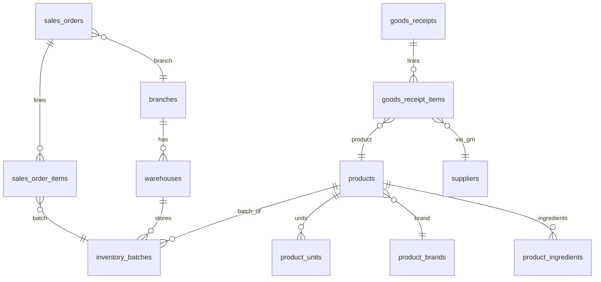

# QĐ 540/QĐ-QLD — Bảng 1: Map 23 trường → schema Novixa (v1)

**Phụ lục A — Hồ sơ đăng ký liên thông Cục Quản lý Dược**

**Mã:** NVX-CQD-PL-A · **Mã nội bộ:** NVX-INT-540-01 · **Version:** 1.0 · **Ngày:** 10/07/2026  
**Văn bản:** [Quyết định 540/QĐ-QLD](https://hieuluat.vn/y-te/quyet-dinh-540-qd-qld-cuc-quan-ly-duoc-28977.html) (20/08/2018) — *Chuẩn yêu cầu dữ liệu đầu ra phần mềm kết nối liên thông cơ sở bán lẻ thuốc* v1.0  
**Phạm vi:** Chỉ **Bảng 1** (dữ liệu mua/bán/tồn theo cơ sở bán lẻ). Bảng 2–4 và QĐ 777/228 nằm ngoài tài liệu này.

---

## 1. Mục tiêu & grain xuất liệu

### 1.1 Mục tiêu

Định nghĩa cách Novixa **materialize** 23 chỉ tiêu Bảng 1 từ schema PostgreSQL hiện tại, phục vụ:

- Exporter nội bộ (CSV/JSON) để kiểm thử trước liên thông
- Connector QĐ 777 (đẩy lên CSDL Dược QG / Viettel) — giai đoạn sau

### 1.2 Grain đề xuất (2 loại dòng)

Bảng 540 không ghi rõ 1 dòng = 1 giao dịch hay 1 snapshot; thực tế liên thông thường cần **sự kiện** + **tồn**:

| Loại dòng | `event_type` nội bộ | Khi nào sinh | `so_luong_nhap` | `so_luong_ban` | `so_luong_ton` |
|-----------|---------------------|--------------|-----------------|----------------|----------------|
| **IN** (nhập) | `grn` | Mỗi dòng GRN hoàn tất | = SL nhập (ĐVT NN) | `0` | tồn sau nhập (optional) |
| **OUT** (bán) | `sale` | Mỗi dòng đơn bán hoàn tất | `0` | = SL bán (ĐVT NN) | tồn sau bán (optional) |
| **SNAPSHOT** (tồn) | `stock` | Cuối ngày / theo lịch sync | `0` | `0` | = tồn hiện tại |

**Khóa logic (logical key):**

```
(tenant_id, branch_id, ma_co_so_ban_le, ma_thuoc, so_lo, event_type, source_id, ngay_event)
```

- `source_id` = `goods_receipt_items.id` | `sales_order_items.id` | `inventory_batches.id` (snapshot)

### 1.3 Phạm vi tenant / chi nhánh

- **`Ma_co_so_ban_le`**: gắn **chi nhánh bán lẻ** (`branches`), không phải `tenant_id`.
- Một tenant nhiều chi nhánh → nhiều mã cơ sở, export tách theo `branch_id`.
- Kho (`warehouses.branch_id`) dùng để suy ra chi nhánh khi nhập/bán.

---

## 2. Bảng map 23 trường

**Chú thích cột Map:**

| Ký hiệu | Ý nghĩa |
|---------|---------|
| ✅ | Có sẵn, map trực tiếp |
| ⚠️ | Có một phần / cần transform |
| ❌ | Chưa có — cần schema hoặc master data |
| 🔧 | Cần hàm transform (encoder/formatter) |

---

### 2.1 Danh mục & định danh thuốc (1–11)

| STT | Trường 540 | Kiểu / max | Bắt buộc | Nguồn Novixa | Transform / ghi chú | Map |
|-----|------------|------------|----------|--------------|---------------------|-----|
| 1 | `ma_thuoc` | Chuỗi 50 | x | `products.national_drug_id` | 🔧 Nếu null: **`encodeMaThuoc540(so_dang_ky, don_vi_dong_goi_nn)`** — bỏ dấu `-`, space; nối quy cách NN (VD: `VN-12345-18` + `lọ 200 viên` → `VN1234518lo200vien`). **Không** dùng `product_code`. | ⚠️ |
| 2 | `ten_thuoc` | Chuỗi 50 | x | `products.product_name` | `LEFT(TRIM(product_name), 50)` | ✅ |
| 3 | `so_dang_ky` | Chuỗi 20 | x | `products.national_registration_number` | Fallback: parse từ CSDL QG khi prefill; reject export nếu null trên SP thuốc. | ⚠️ |
| 4 | `ten_hoat_chat` | Chuỗi 50 | x | `products.generic_name` **hoặc** `product_ingredients` ⋈ `active_ingredients` | Nếu >3 hoạt chất: 540 chỉ ghi khi ≤3 — dùng tên đơn hoặc generic_name gộp; cắt 50 ký tự. | ⚠️ |
| 5 | `nong_do_ham_luong` | Chuỗi 20 | x | `product_ingredients.strength_value` + `strength_unit` | Hoặc field QG `strength` khi sync catalog; fallback parse từ `generic_name`. | ⚠️ |
| 6 | `nha_san_xuat` | Chuỗi 100 | x | `product_brands.brand_name` | `products.brand_id` → `product_brands`. Nếu null: `products.attributes->>'manufacturer'`. | ⚠️ |
| 7 | `nuoc_san_xuat` | Chuỗi 20 | x | `product_brands.country_code` | Map ISO → tên nước tiếng Việt (VD: `VN` → `Việt Nam`). | ⚠️ |
| 8 | `nha_nhap_khau` | Chuỗi 100 | x | **Gap** | Đề xuất: `products.attributes->>'importerName'` hoặc cột mới `importer_name`; không dùng tên NCC bán buôn nội địa thay thế nếu không đúng vai trò NK. | ❌ |
| 9 | `quy_cach_dong_goi` | Chuỗi 20 | x | **Gap / QG** | `products.attributes->>'packaging'` hoặc field QG `packaging` khi liên thông QĐ 522; cắt 20. | ❌ |
| 10 | `dang_bao_che` | Chuỗi 20 | x | **Gap / QG** | `products.attributes->>'dosageForm'` hoặc QG `dosageForm`; cắt 20. | ❌ |
| 11 | `don_vi_dong_goi_nn` | Chuỗi 20 | x | `product_units.unit_name` | Lấy **ĐVT nhỏ nhất**: `is_base_unit = TRUE` hoặc `conversion_factor = 1` và `is_sale_unit = TRUE`; tuân NĐ 54/2017 — có thể cần master ĐVT chuẩn. | ⚠️ |

**Bảng liên quan:** `products`, `product_brands`, `product_units`, `product_ingredients`, `active_ingredients`, CSDL QG (mock/live).

---

### 2.2 Giá, lô, số lượng (12–17)

| STT | Trường 540 | Kiểu | Bắt buộc | Nguồn Novixa | Transform / ghi chú | Map |
|-----|------------|------|----------|--------------|---------------------|-----|
| 12 | `gia_ban_le` | Số 10 | x | **IN:** `goods_receipt_items.unit_cost` (không phải giá bán) · **OUT:** `sales_order_items.unit_price` · **Master:** `product_prices.price` (`price_type=1`) | Với dòng **bán**: dùng `unit_price` trên dòng bán, quy về **giá/ĐVT NN** (chia `conversion_factor` nếu bán theo hộp). Số nguyên VND, không decimal trong payload 540. | ⚠️ |
| 13 | `so_lo` | Chuỗi 20 | x | `inventory_batches.batch_number` | Cắt 20; nguồn GRN: `goods_receipt_items.batch_number` → batch. | ✅ |
| 14 | `han_dung` | Số 8 | x | `inventory_batches.expiry_date` | 🔧 `formatHanDung540(date)` → `YYYYMMDD` (VD: 2018-12-15 → `20181215`). | ✅ |
| 15 | `so_luong_nhap` | Số | x | `goods_receipt_items.quantity` + `stock_movements` (`movement_type=1`, `reference_type='goods_receipt'`) | 🔧 Quy về ĐVT NN: `qty * product_units.conversion_factor` (từ `product_unit_id` GRN về base unit). Dòng OUT để `0`. | ⚠️ |
| 16 | `so_luong_ban` | Số | x | `sales_order_items.quantity` (`sales_orders.status = Completed`) trừ `sales_return_items` | 🔧 Quy về ĐVT NN tương tự; dòng IN để `0`. | ⚠️ |
| 17 | `so_luong_ton` | Số | x | `inventory_batches.quantity_available` | 🔧 Quy về ĐVT NN; snapshot hoặc tồn sau giao dịch. | ⚠️ |

**Join path bán:**

```
sales_orders (status=Completed)
  → sales_order_items (product_id, product_unit_id, batch_id, quantity, unit_price)
  → inventory_batches (batch_number, expiry_date, warehouse_id)
  → warehouses (branch_id)
  → branches
```

**Join path nhập:**

```
goods_receipts (status posted)
  → goods_receipt_items
  → inventory_batches (via goods_receipt_item_id)
  → suppliers
  → warehouses → branches
```

---

### 2.3 Nguồn cung & chứng từ mua (18–19)

| STT | Trường 540 | Kiểu | Bắt buộc | Nguồn Novixa | Transform / ghi chú | Map |
|-----|------------|------|----------|--------------|---------------------|-----|
| 18 | `don_vi_bthuoc_cho_csbl` | Chuỗi 100 | x | `suppliers.supplier_name` | Từ GRN: `goods_receipts.supplier_id` → `suppliers`. **Chỉ** trên dòng IN; dòng OUT có thể để rỗng hoặc lặp NCC nguồn lô (cần xác nhận Sở). | ⚠️ |
| 19 | `so_hoa_don_mthuoc` | Chuỗi 20 | x | **Gap** | Schema hiện chỉ có `goods_receipts.grn_number`, **không** có số HĐ GTGT mua thuốc. Cần cột `goods_receipts.supplier_invoice_number` (VARCHAR 20). | ❌ |

---

### 2.4 Thời gian & mã cơ sở (20–23)

| STT | Trường 540 | Kiểu | Bắt buộc | Nguồn Novixa | Transform / ghi chú | Map |
|-----|------------|------|----------|--------------|---------------------|-----|
| 20 | `ngay_nhap` | Số 12 | x | `goods_receipts.receipt_date` | 🔧 `formatDateTime540(ts)` → `YYYYMMDDHHmm` (VD: `201808081030`). Chỉ dòng IN. | ⚠️ |
| 21 | `ngay_ban` | Số 12 | x | `sales_orders.order_date` | 🔧 Cùng format; chỉ dòng OUT (`status=Completed`). | ⚠️ |
| 22 | `Ma_co_so_ban_le` | Chuỗi 12 | x | **Gap** | Cục QLD cấp — lưu `branches.attributes->>'qd540RetailFacilityCode'` hoặc cột `retail_facility_code CHAR(12)`. **Bắt buộc** trước khi export. | ❌ |
| 23 | `Ma_co_so_ban_buon` | Chuỗi 12 | x | **Gap** | Mã CS bán buôn (NCC) do Cục QLD cấp — `suppliers.attributes->>'qd540WholesaleFacilityCode'`. Không thay bằng `tax_code`. | ❌ |

---

## 3. Sơ đồ quan hệ (read model)



---

## 4. SQL read model (draft view)

View phục vụ exporter — **chưa triển khai**, tham chiếu implement:

```sql
-- pack_pharmacy.v_qd540_table1_sale_lines (draft)
SELECT
    so.tenant_id,
    b.id AS branch_id,
    -- Ma_co_so_ban_le: branches.retail_facility_code  (TODO migration)
    p.national_drug_id,
    p.national_registration_number,
    p.product_name,
    p.generic_name,
    pb.brand_name,
    pb.country_code,
    ib.batch_number,
    ib.expiry_date,
    soi.quantity,
    soi.unit_price,
    pu.conversion_factor,
    so.order_date,
    w.branch_id AS warehouse_branch_id
FROM sales_orders so
JOIN sales_order_items soi ON soi.sales_order_id = so.id
JOIN products p ON p.id = soi.product_id
JOIN inventory_batches ib ON ib.id = soi.batch_id
JOIN product_units pu ON pu.id = soi.product_unit_id
JOIN warehouses w ON w.id = so.warehouse_id
JOIN branches b ON b.id = so.branch_id
LEFT JOIN product_brands pb ON pb.id = p.brand_id
WHERE so.status = 2;  -- Completed
```

Tương tự `v_qd540_table1_grn_lines` từ `goods_receipts` + `goods_receipt_items`.

---

## 5. Transform functions (C# service)

Đề xuất module: `KitPlatform.Packs.Pharmacy.Integration.Qd540`

| Hàm | Input | Output | Rule |
|-----|-------|--------|------|
| `EncodeMaThuoc540` | `soDangKy`, `packagingSmallest` | `ma_thuoc` | Bỏ `-`, space; lowercase không dấu; nối quy cách |
| `FormatHanDung540` | `DateOnly?` | `int?` | `yyyyMMdd` |
| `FormatDateTime540` | `DateTimeOffset` | `long` | `yyyyMMddHHmm` (timezone `Asia/Ho_Chi_Minh`) |
| `ToSmallestUnitQty` | `qty`, `productUnitId` | `decimal` | `qty * conversion_factor` về base unit |
| `ResolveTenHoatChat540` | product + ingredients | `string` | ≤3 substances rule |
| `ResolveGiaBanLe540` | sale line / price list | `long` | VND integer, per smallest unit |

**DTO xuất:**

```csharp
public sealed record Qd540Table1RowDto(
    string MaThuoc,
    string TenThuoc,
    string SoDangKy,
    string TenHoatChat,
    string NongDoHamLuong,
    string NhaSanXuat,
    string NuocSanXuat,
    string NhaNhapKhau,
    string QuyCachDongGoi,
    string DangBaoChe,
    string DonViDongGoiNn,
    long GiaBanLe,
    string SoLo,
    int HanDung,
    decimal SoLuongNhap,
    decimal SoLuongBan,
    decimal SoLuongTon,
    string DonViBThuocChoCsbl,
    string SoHoaDonMThuoc,
    long? NgayNhap,
    long? NgayBan,
    string MaCoSoBanLe,
    string MaCoSoBanBuon);
```

---

## 6. Gap schema — migration đề xuất

| # | Thay đổi | Lý do 540 |
|---|----------|-----------|
| G1 | `branches.retail_facility_code VARCHAR(12)` | `Ma_co_so_ban_le` |
| G2 | `suppliers.wholesale_facility_code VARCHAR(12)` | `Ma_co_so_ban_buon` |
| G3 | `goods_receipts.supplier_invoice_number VARCHAR(20)` | `so_hoa_don_mthuoc` |
| G4 | `products.dosage_form VARCHAR(20)`, `products.packaging VARCHAR(20)`, `products.importer_name VARCHAR(100)` | `dang_bao_che`, `quy_cach_dong_goi`, `nha_nhap_khau` — hoặc sync từ QG vào cột thay vì chỉ `attributes` JSONB |
| G5 | `products.national_drug_id` NOT NULL constraint (soft) cho `product_kind='pharmacy_drug'` trước go-live liên thông | `ma_thuoc` |
| G6 | Bảng `qd540_export_log` (tenant, branch, payload_hash, exported_at, status) | idempotent sync / audit |

**Không bắt buộc ngay:** thay `attributes` JSONB bằng cột typed — JSONB đủ cho MVP nếu UI admin cho nhập.

---

## 7. Validation trước export

| Rule | Hành vi |
|------|---------|
| `Ma_co_so_ban_le` null | **Block** export chi nhánh |
| `national_registration_number` null trên thuốc | **Warn** / block tùy policy |
| `ma_thuoc` null | Derive bằng encoder; fail nếu thiếu `so_dang_ky` + packaging |
| `han_dung` null trên lô bán | **Block** dòng (540 bắt buộc) |
| Đơn nháp / GRN nháp | Loại khỏi export |
| SP `product_kind != pharmacy_drug` | Loại (TPCN/TBYT có thể có quy định riêng — tách scope) |

---

## 8. Tóm tắt mức sẵn sàng map

| Nhóm | ✅ | ⚠️ | ❌ |
|------|----|----|-----|
| Trường 1–11 (master thuốc) | 1 | 8 | 3 |
| Trường 12–17 (lô/SL/giá) | 2 | 5 | 0 |
| Trường 18–23 (chứng từ/mã CS) | 0 | 3 | 3 |
| **Tổng 23** | **3** | **16** | **6** |

**Kết luận kỹ thuật:** Novixa **có nền** (products, lô, GRN, bán, NCC, chi nhánh) để map **~83% trường** với transform; **6 trường** cần master data/pháp lý (mã cơ sở, HĐ GTGT, NK, dạng bào chế/quy cách structured). **Chưa có** pipeline export QĐ 540 — spec này là input cho ticket **G1.1b / INT-540**.

---

## 9. Thứ tự implement đề xuất

1. Migration G1–G4 + UI admin (mã cơ sở, HĐ GRN, importer/packaging/dosage)
2. `Qd540TransformService` + unit tests (encoder `ma_thuoc`, datetime)
3. SQL views `v_qd540_table1_grn_lines` / `_sale_lines`
4. API nội bộ `GET /api/pharmacy/integration/qd540/table1?from=&to=&branchId=`
5. Export CSV mẫu 540 cho Sở Y tế kiểm thử
6. Connector QĐ 777 (ngoài scope map schema)

---

## 10. Liên quan

- [`hypercare-week1-4-runbook-v1.md`](./hypercare-week1-4-runbook-v1.md)
- [`novixa-target-requirements-and-completion-sequence-v1.md`](../02-product/novixa-target-requirements-and-completion-sequence-v1.md) — G1.1
- Code hiện tại: `MockNationalDrugCatalogService`, migration `040_product_national_drug_link.sql`
- Văn bản bổ sung: **QĐ 777/QĐ-QLD** (kết nối), **QĐ 228/QĐ-QLD** (cập nhật Bảng 3 đơn thuốc)
