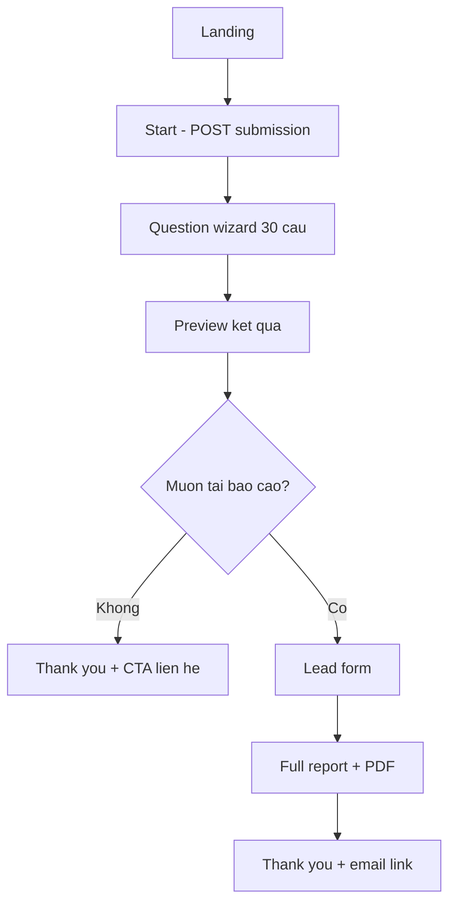

# Assessment Public Web — Wireframe v1

**Mã:** KIT-ASM-UI-01 · **Template:** PHARMACY_V1 · **Kênh:** Public web (anonymous)

> Spec API: [assessment-engine-api-v1.md](../03-solution/assessment-engine-api-v1.md)  
> **Thang điểm:** 1–4 · **Gate:** SĐT + email trước khi tải PDF

---

## 1. User flow



---

## 2. Màn hình

### 2.1 Landing (`/`)

```
┌─────────────────────────────────────────────────────────────┐
│  [Logo Novixa]                              vi | en         │
├─────────────────────────────────────────────────────────────┤
│                                                             │
│     Đánh giá năng lực nhà thuốc — miễn phí                   │
│     30 câu · ~8 phút · Báo cáo phân tích chuyên sâu          │
│                                                             │
│     ✓ Khách hàng  ✓ Kho  ✓ Kinh doanh  ✓ Công nghệ           │
│                                                             │
│              [ Bắt đầu đánh giá ]                            │
│                                                             │
│     Không cần đăng ký · Xem trước kết quả miễn phí          │
└─────────────────────────────────────────────────────────────┘
```

**Actions:** `POST /submissions` → redirect `/survey/{submissionId}`

---

### 2.2 Question wizard (`/survey/{id}`)

```
┌─────────────────────────────────────────────────────────────┐
│  ← Lưu & thoát          Khách hàng (1/6)          12/30      │
│  ████████░░░░░░░░░░░░  40%                                   │
├─────────────────────────────────────────────────────────────┤
│  C1 · Khách hàng                                            │
│                                                             │
│  Nhà thuốc hiện có lưu hồ sơ khách hàng không?               │
│                                                             │
│  ○ Không lưu                                                │
│  ○ Chỉ lưu số điện thoại                                    │
│  ● Lưu thông tin cơ bản                                     │
│  ○ Lưu đầy đủ và cập nhật thường xuyên                       │
│                                                             │
│              [ Quay lại ]    [ Tiếp theo ]                   │
└─────────────────────────────────────────────────────────────┘
```

**UX rules:**
- Nhóm theo **Category** (6 tab/step); trong tab scroll **Question**
- Auto-save mỗi câu → `PUT /responses`
- `session_token` cookie
- G4/G5: cùng UI radio, badge “Không tính điểm — giúp tư vấn”
- Cuối wizard: `POST /complete` → `/results/{id}`

**Mobile:** 1 câu / màn; swipe next

---

### 2.3 Preview kết quả (`/results/{id}`) — TRƯỚC gate

```
┌─────────────────────────────────────────────────────────────┐
│  Kết quả sơ bộ                                               │
├─────────────────────────────────────────────────────────────┤
│                                                             │
│        ┌─────────────────────────────────┐                  │
│        │   ĐIỂM TỔNG: 2.9 / 4  (63%)     │                  │
│        │   [====●=====     ]             │                  │
│        └─────────────────────────────────┘                  │
│                                                             │
│   Khách hàng    ████████░░  3.2                            │
│   Vận hành      ██████░░░░  2.4                            │
│   Kho           ███████░░░  2.8                            │
│   Kinh doanh    █████░░░░░  2.0                            │
│   CNTT          ████░░░░░░  1.8  ← điểm thấp nhất           │
│   Phát triển    ██████░░░░  2.5                            │
│                                                             │
│   💡 Nhà thuoc dang dung Excel — co hoi chuyen doi he thong  │
│      (1 insight teaser)                                      │
│                                                             │
│   ┌─────────────────────────────────────────────────────┐   │
│   │ 🔒 Báo cáo đầy đủ + PDF + lộ trình cải thiện        │   │
│   │    Nhập SĐT & email để nhận ngay                     │   │
│   │              [ Nhận báo cáo chi tiết ]               │   │
│   └─────────────────────────────────────────────────────┘   │
│                                                             │
│   [ Bỏ qua — chỉ xem sơ bộ ]                                 │
└─────────────────────────────────────────────────────────────┘
```

**Không hiển thị:** full recommendations, PDF link, dimension drill-down

---

### 2.4 Lead gate (`/results/{id}/unlock`)

```
┌─────────────────────────────────────────────────────────────┐
│  Nhận báo cáo phân tích đầy đủ                               │
├─────────────────────────────────────────────────────────────┤
│  Họ tên *          [ Nguyen Van A                    ]       │
│  Tên nhà thuốc *   [ Nha thuoc ABC                   ]       │
│  Số điện thoại *   [ 0909123456                      ]       │
│  Email *           [ owner@example.com                 ]       │
│  Ghi chú           [ Muon tu van phan mem...         ]       │
│                                                             │
│  ☑ Tôi đồng ý nhận tư vấn từ Novixa (tùy chọn marketing)    │
│                                                             │
│              [ Tải báo cáo PDF ]                             │
│                                                             │
│  Chúng tôi không spam. Dữ liệu theo chính sách bảo mật.       │
└─────────────────────────────────────────────────────────────┘
```

**Actions:** `POST /capture-lead` → `/report/{id}`

**Validation inline:** phone VN, email format

---

### 2.5 Full report (`/report/{id}`)

```
┌─────────────────────────────────────────────────────────────┐
│  Báo cáo PHARMACY_V1 · Nhà thuốc ABC          [ Tải PDF ]   │
├─────────────────────────────────────────────────────────────┤
│  Tổng quan · Radar chart 6 category                          │
│                                                             │
│  ── Insight ──                                              │
│  • Điểm CNTT thấp — dữ liệu rời rạc                         │
│  • Điểm Kinh doanh cần cải thiện đo lường KM                 │
│                                                             │
│  ── Đề xuất ưu tiên ──                                       │
│  1. [CRM] Triển khai Health Wallet + Loyalty (4-8 tuần)     │
│  2. [Tech] Chuyển từ Excel sang ERP liên kết                │
│                                                             │
│  ── Nhu cầu của bạn (G5) ──                                  │
│  Ưu tiên: Giữ chân khách hàng                               │
│  Trở ngại: Quản lý kho                                      │
│                                                             │
│              [ Đặt lịch tư vấn ]  [ Tải PDF ]                │
└─────────────────────────────────────────────────────────────┘
```

---

### 2.6 Thank you (`/done`)

```
┌─────────────────────────────────────────────────────────────┐
│  ✓ Cảm ơn bạn!                                               │
│  Báo cáo đã gửi tới owner@example.com                        │
│  Đội ngũ Novixa sẽ liên hệ trong 1-2 ngày làm việc.          │
│              [ Về trang chủ Novixa ]                         │
└─────────────────────────────────────────────────────────────┘
```

---

## 3. Component map (React SPA gợi ý)

| Route | Component |
|-------|-----------|
| `/` | `AssessmentLandingPage` |
| `/survey/:id` | `AssessmentWizardPage` |
| `/results/:id` | `AssessmentPreviewPage` |
| `/results/:id/unlock` | `AssessmentLeadGatePage` |
| `/report/:id` | `AssessmentReportPage` |

**Stack gợi ý:** Vite + React (cùng pattern `client/customer-app`), Ant Design, recharts radar.

**Host:** `client/assessment-web` hoặc route trên `novixa-site`.

---

## 4. Responsive

| Breakpoint | Wizard | Preview |
|------------|--------|---------|
| Mobile | 1 câu/full screen | Stack vertical |
| Desktop | Category sidebar + question panel | Radar + bars 2 cột |

---

## 5. Accessibility

- Radio keyboard navigable
- Progress `aria-valuenow`
- Focus trap trên lead modal
- Contrast ≥ WCAG AA

---

## 6. Analytics (optional)

| Event | Trigger |
|-------|---------|
| `assessment_started` | POST submission |
| `assessment_question_answered` | PUT response |
| `assessment_completed` | POST complete |
| `assessment_lead_captured` | POST capture-lead |
| `assessment_pdf_downloaded` | GET pdf |

---

*Wireframe v1 — implement after API services*
