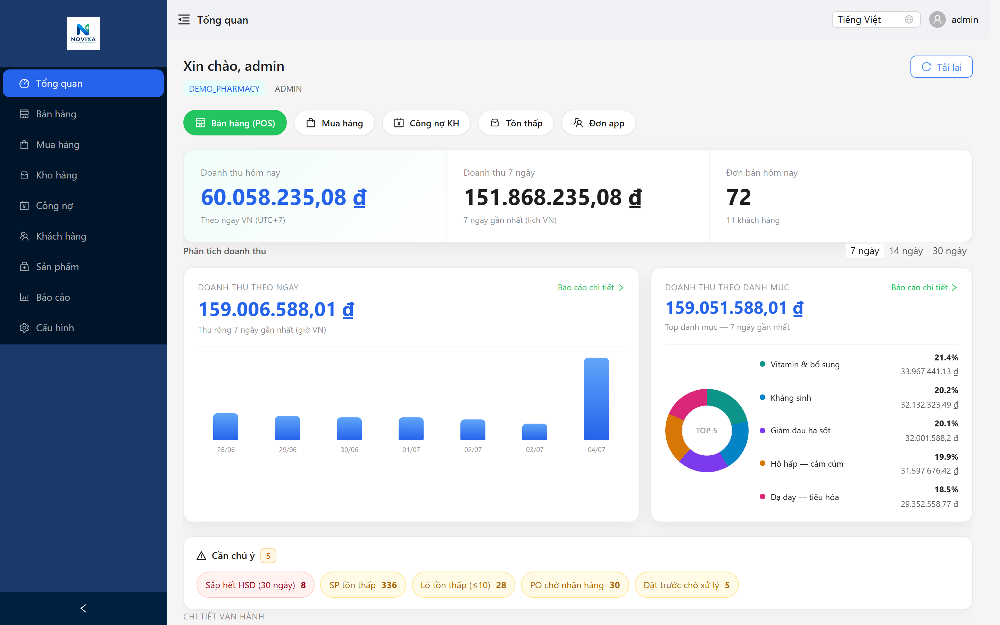
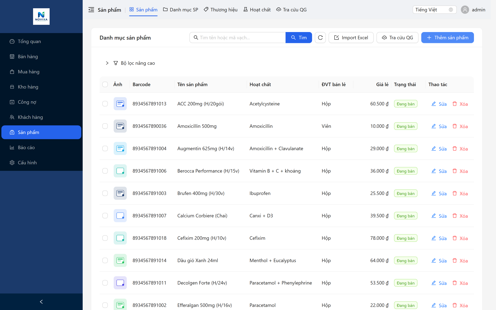
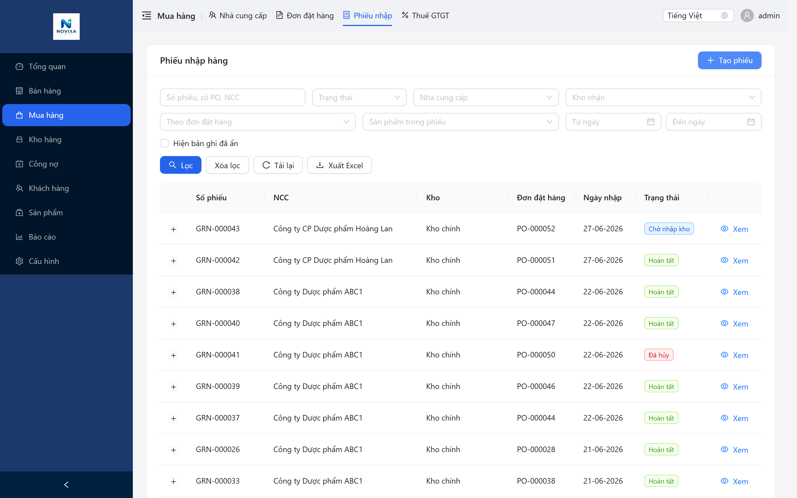
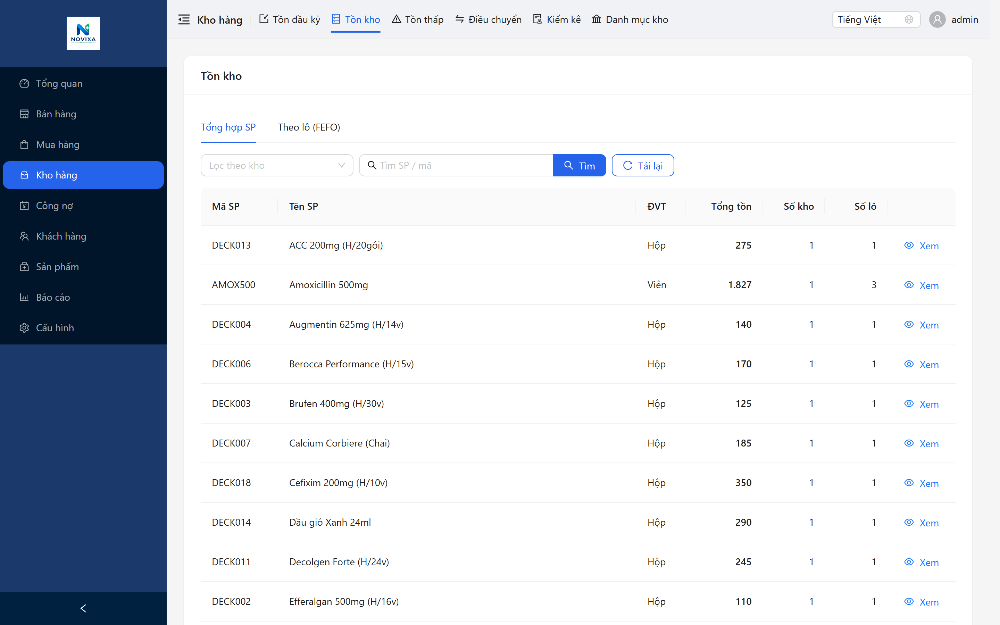
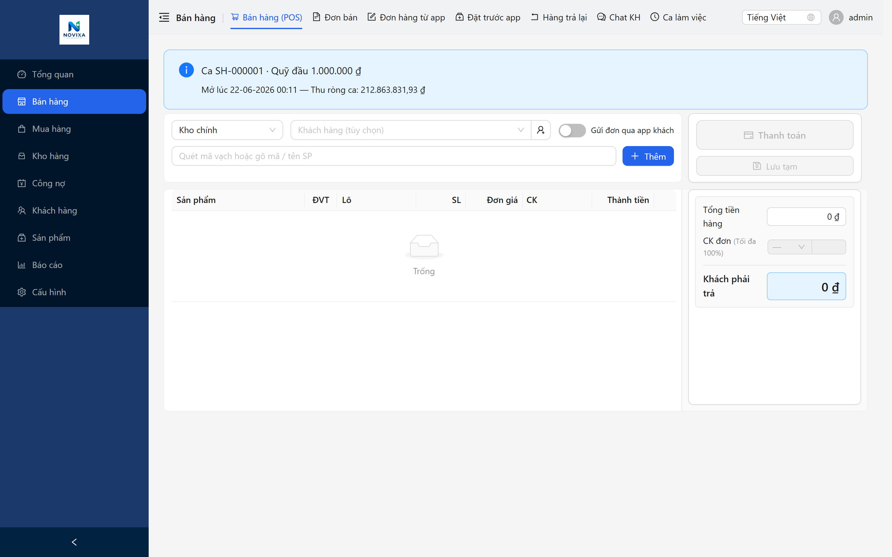
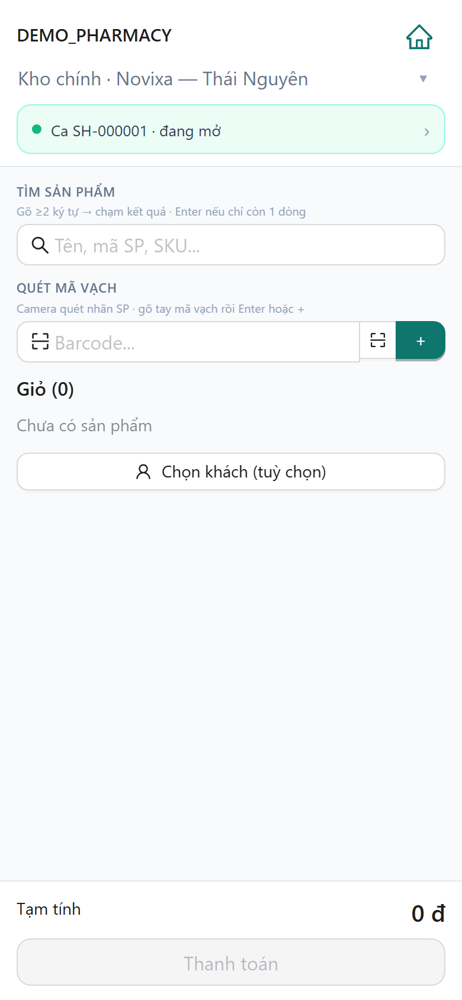
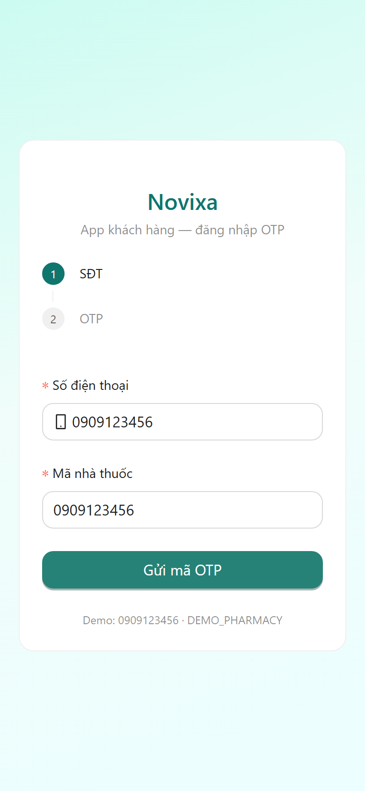
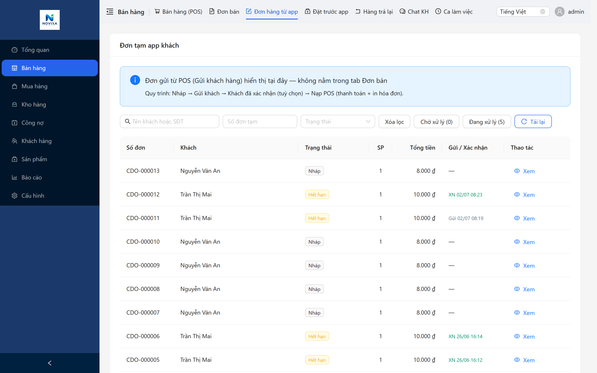
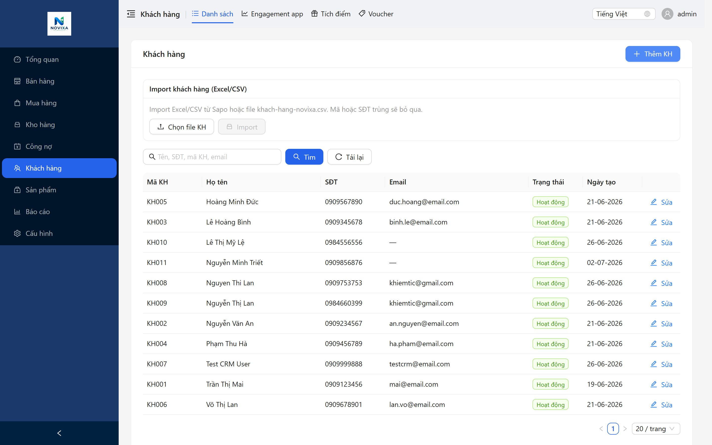
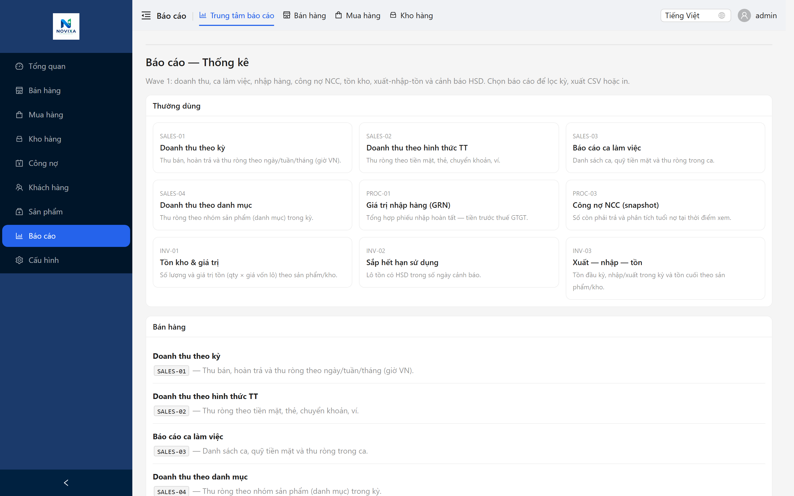

# Novixa — Sales Deck V1 (Full)

**Mã:** NVX-GTM-03 / DOC-008 · **Tier:** T2 · **Version:** 1.2 · **Slides:** 35

> Speaker notes: *italic*. Nguồn product truth: [module-catalog-v1.md](../../02-product/module-catalog-v1.md)

---

## Slide 1 — Cover

**Novixa — Nền tảng quản trị nhà thuốc thế hệ mới**

Smart Pharmacy Solutions · Giải pháp dược thông minh

ERP + POS + Kho lô FEFO + CRM + App khách + Báo cáo — trên **một hệ dữ liệu**

Founding Early Access 2026 · novixa.vn

*Mở đầu bằng câu chuyện vận hành nhà thuốc, không mở bằng giá. Hỏi tên NT, số quầy, đang dùng phần mềm gì.*

---

## Slide 2 — Nội dung buổi trình bày

**Hôm nay chúng ta trao đổi**

- Bài toán vận hành nhà thuốc GPP — vì sao Excel + POS rẻ không đủ
- **Mục tiêu kinh doanh:** giữ khách · tăng doanh thu lặp lại · giảm phụ thuộc khách vãng lai
- **Novixa Platform** — kiến trúc và luồng dữ liệu end-to-end
- **6 trụ ERP** (Danh mục · Mua · Kho · Báo cáo) + **2 module chiến lược:** **POS quầy** & **App khách**
- Chi tiết **từng chức năng con** — đặt hàng qua app, quầy gửi đơn cho khách, O2O hai chiều
- Triển khai Founding Early Access 2026

*Thời lượng ~60 phút gồm demo live. Slide 3–6: pain & mục tiêu KD; 7–28: product sâu; 29–35: commercial.*

---

## Slide 3 — Bức tranh vận hành hiện tại

**Nhà thuốc GPP đang chạy bằng 3–5 công cụ rời nhau**

- **POS quầy** — chỉ biết doanh thu ca, không biết tồn lô còn bao nhiêu ở kho
- **Excel / sổ giấy** — tồn đầu, công nợ NCC, danh sách cận date cập nhật thủ công
- **Zalo / SĐT** — đặt hàng, hỏi thuốc, không gắn với tồn và lịch sử mua
- **Báo cáo cuối tháng** — tổng hợp chậm, khó biết hôm nay nên nhập gì

**Hệ quả:** Dược sĩ và chủ NT mất thời gian **đối soát** thay vì **quản lý chuyên môn**

*Hỏi khách: Anh/chị đang mất nhiều thời gian nhất ở khâu nào — tồn, nhập hàng, hay khách quay lại?*

---

## Slide 4 — Pain cụ thể tại quầy và kho

**Những tình huống vẫn xảy ra khi thiếu hệ thống thống nhất**

- Bán **nhầm lô** — lô cận date còn trong kho nhưng quầy không thấy
- **Không truy vết** được lô đã bán khi cần đối chiếu NCC hoặc kiểm tra nội bộ
- Nhập hàng **không khớp** GRN thực tế — chênh lệch phát hiện muộn
- **Hàng chết** ở kho — không có cảnh báo HSD sớm, lãng phí vốn
- Chuỗi 2–3 cửa — **không so sánh** doanh thu / tồn giữa các quầy trong ngày

*Mục tiêu slide: khách gật đầu “đúng pain của tôi” trước khi giới thiệu Novixa.*

---

## Slide 5 — Chi phí ẩn nếu không thay đổi

**Không chỉ là “phần mềm đắt hay rẻ” — mà là chi phí vận hành mỗi tháng**

| Pain | Biểu hiện | Hướng tác động |
|------|----------|----------------|
| Thất thoát tồn | Xuất nhập không khớp lô | % doanh thu mất hàng tháng |
| Hủy cận date | Không FEFO, không cảnh báo | Vốn + thời gian xử lý |
| Nhập sai / thiếu | Quyết định mua bằng cảm giác | Thiếu hàng hot, dư hàng chậm |
| Mất khách | Không CRM, không nhắc tái mua | Doanh thu lặp lại thấp |
| Mở rộng chuỗi chậm | Mỗi cửa một cách làm | Không scale được |

*Không cần số % tuyệt đối — dùng ví dụ từ pain khách vừa chia sẻ.*

---

## Slide 6 — Mục tiêu kinh doanh: Giữ khách · Tăng doanh thu

**Novixa không chỉ “quản lý kho đúng” — mục đích cuối là tăng doanh thu bền vững**

**Vì sao nhà thuốc cần hệ thống gắn khách hàng?**

- **80% doanh thu lặp lại** đến từ khách quen — thuốc mãn, vitamin, chăm sóc mạn tính
- Khách vãng lai = **CAC cao** (quảng cáo, vị trí) nhưng **LTV thấp** — khó dự báo doanh thu tháng
- Zalo/Facebook order **không lưu lịch sử** → mất cơ hội nhắc tái mua, tích điểm, giữ hàng

**Novixa giải quyết bằng vòng lặp doanh thu**

```
Khách lần đầu (POS) → CRM + tích điểm → App khách (nhắc uống / đặt lại)
       ↑                                              ↓
Quầy chốt đơn (POS) ← O2O / đơn nháp ← Khách đặt trước trên app
```

**Kết quả mong đợi (founding customer)**

- Tăng **tần suất quay lại** — nhắc uống thuốc, voucher, đơn nháp sẵn
- Tăng **giá trị đơn** — loyalty, gợi ý mua kèm có kiểm soát tại quầy
- Giảm **mất khách sang đối thủ** — app riêng nhà thuốc, không phải inbox Zalo

*Thông điệp sales: “Anh/chị đầu tư ERP một lần — nhưng ROI đo được ở **doanh thu khách quay lại**, không chỉ ở tồn kho.”*

---

## Slide 7 — Novixa giải quyết ở tầng nào?

**Novixa không thay POS thu ngân — Novixa thay “cách quản trị toàn nhà thuốc”**

- **Một database nghiệp vụ** — mua, tồn, bán, khách, báo cáo cùng nguồn
- **Thiết kế cho GPP vận hành** — lô, HSD, FEFO, kiểm kê, audit
- **Quầy bán nhanh** — POS tích hợp sẵn kho lô, không nhập tồn tay sau ca
- **Mở rộng O2O hai chiều** — khách đặt qua app **và** quầy gửi đơn sẵn lên app khách
- **SaaS cloud** — không cài server tại quầy, cập nhật tập trung

**Phân loại:** ERP nhà thuốc · **Không phải** phần mềm kế toán thay thế · **Không phải** tư vấn y khoa

---

## Slide 8 — Kiến trúc Novixa Platform

**4 lớp — 1 nền tảng KitPlatform**

- **Lớp trải nghiệm**
  - Admin Web (`admin.novixa.vn`) — quản lý, mua hàng, kho, CRM, báo cáo
  - POS Desktop / POS route (`pos.novixa.vn`) — thu ngân tại quầy
  - Staff App (mobile) — bán hàng, tra tồn, O2O khi di chuyển
  - Customer App (`app.novixa.vn`) — khách hàng: OTP, điểm, đặt trước, chat
- **Lớp API** — `api.novixa.vn` · multi-tenant · phân quyền RBAC
- **Lớp dữ liệu** — PostgreSQL · `stock_movements` là sổ cái tồn
- **Marketing** — `novixa.vn` tách biệt ERP (bảo mật, cập nhật nội dung độc lập)

*Vẽ tay hoặc dùng sơ đồ 4 khối. Nhấn mạnh: khách và chủ NT chỉ cần nhớ admin + app + quầy.*

---

## Slide 9 — Luồng dữ liệu end-to-end

**Từ lúc hàng về kho đến khi khách quay lại — không đứt gãy**

1. **Danh mục** — mã SP, barcode, đơn vị, giá, hoạt chất, phân loại *(catalog không chứa tồn)*
2. **Mua hàng** — PO → GRN → tăng tồn **theo lô + HSD** + VAT cơ bản
3. **Kho** — tồn available, chuyển kho, điều chỉnh, kiểm kê có duyệt
4. **Bán POS** — FEFO xuất lô · ca · thanh toán · in bill · trả hàng
5. **Khách hàng** — CRM, điểm, voucher, app đặt trước → quầy xử lý O2O
6. **Báo cáo** — doanh thu, tồn, cận date, công nợ — **trong ngày**

>> **Nhìn vào màn hình:** Doanh thu hôm nay (triệu VND) · biểu đồ 7 ngày · số đơn · cảnh báo cận date/tồn thấp — mở admin là thấy ngay tình hình quầy.



*Đây là “story xương sống” cho demo. Mỗi bước tương ứng 1–2 màn hình live.*

---

## Slide 10 — Ai phù hợp Novixa?

**Ideal Customer Profile — Founding 2026**

✅ **Rất phù hợp**

- Nhà thuốc **GPP** — độc lập hoặc chuỗi **2–10 cửa**
- Đang dùng **Excel + POS** hoặc POS không quản lý lô/HSD
- Muốn **gom quầy + kho + khách** trước khi mở thêm chi nhánh
- Sẵn sàng **migrate + training 4 tuần** — chạy thật, không pilot giả

❌ **Chưa phù hợp (nói thẳng, giữ quan hệ)**

- Chỉ cần thu ngân, không quan tâm lô/HSD/FEFO
- Kỳ vọng **HĐĐT + kế toán thuế đầy đủ ngay** *(Phase 2 — roadmap)*

---

## Slide 11 — Module 1: Danh mục & Catalog (đầy đủ chức năng con)

**Nền tảng dữ liệu — mọi module dùng chung, không nhập lại**

| Nhóm | Chức năng con | Mô tả ngắn |
|------|---------------|------------|
| **Sản phẩm** | Danh sách · thêm/sửa · ảnh SP | Mã, tên, barcode, đơn vị, giá, mô tả, trạng thái |
| **Phân loại** | Danh mục · thương hiệu · hoạt chất | Nhóm báo cáo doanh thu; tra cứu thành phần |
| **Giá** | Giá bán lẻ / sỉ / VIP | Theo đơn vị bán; **tồn không nằm trong catalog** |
| **Import** | Excel hàng loạt | Migrate nhanh khi onboarding founding |
| **Tra cứu QG** | CSDL thuốc quốc gia | Tham khảo khi nhập SP *(mock V1 — API live roadmap)* |

**Giá trị kinh doanh:** Danh mục sạch → POS quét nhanh · app khách hiển thị đúng SP · báo cáo theo nhóm chính xác

>> **Nhìn vào màn hình:** Cột ảnh · barcode · tên/hoạt chất · giá · trạng thái — sẵn sàng bán tại quầy và trên app.



---

## Slide 12 — Module 2: Mua hàng (Procurement) — đầy đủ chức năng con

**Kiểm soát nguồn hàng → tồn lô chính xác → quyết định nhập đúng**

| Nhóm | Chức năng con | Mô tả ngắn |
|------|---------------|------------|
| **NCC** | Nhà cung cấp | Hồ sơ, MST, điều khoản, lịch sử mua |
| **PO** | Đơn đặt hàng | Đặt theo nhu cầu / cảnh báo tồn thấp |
| **GRN** | Nhập kho | Số lô, HSD, SL, giá nhập — **tăng tồn ngay** |
| **Thuế** | VAT treatment | Cấu hình GTGT cơ bản trên chứng từ mua *(Phase 1)* |
| **AP** | Công nợ NCC | Phải trả, lịch thanh toán, phiếu chi NCC |

**Giá trị kinh doanh:** Biết **vốn hàng thật** · truy vết lô từ NCC · tránh nhập thiếu/thừa làm sai quyết định bán

>> **Nhìn vào màn hình:** Phiếu GRN — NCC · lô · HSD · SL · giá nhập.



---

## Slide 13 — Module 3: Kho & Tồn lô — đầy đủ chức năng con

**Trái tim vận hành GPP — và là nền tảng bán đúng lô trên POS**

| Nhóm | Chức năng con | Mô tả ngắn |
|------|---------------|------------|
| **Tồn lô** | Stock by batch / FEFO | Số lô, HSD, SL khả dụng, kho, chi nhánh |
| **Nhập đầu kỳ** | Opening balance | Khởi tạo tồn theo lô khi go-live |
| **Chuyển kho** | Transfer | Giữa kho/chi nhánh, có log |
| **Điều chỉnh** | Adjustment | Tăng/giảm có lý do, audit |
| **Kiểm kê** | Inventory count | Đếm thực tế → duyệt chênh lệch → điều chỉnh |
| **Cảnh báo** | Tồn thấp · cận date | Dashboard + báo cáo INV-02 — xử lý trước khi hủy |

**Giá trị kinh doanh:** Giảm **hàng chết** · giảm **bán nhầm lô** · tăng **uy tín** với khách và cơ quan kiểm tra

>> **Nhìn vào màn hình:** Tồn theo lô · SL khả dụng · ngày HSD.



---

## Slide 14 — Module chiến lược ①: POS quầy bán — Tổng quan

**POS Novixa = thu ngân nhanh + kiểm soát lô + gắn khách hàng + kênh app**

**Vì sao khách hàng quan tâm POS nhất?**

- Đây là nơi **doanh thu phát sinh** mỗi ngày — tốc độ quét & thanh toán = trải nghiệm khách
- POS rẻ **không trừ tồn lô** → mất kiểm soát; Novixa **mỗi đơn = biến động kho FEFO**
- POS Novixa **gắn CRM ngay tại quầy** — SĐT → tích/đổi điểm → khách quay lại

**Bản đồ chức năng con — Sales / POS (Admin & POS route)**

| Chức năng con | Mô tả |
|---------------|-------|
| **Mở ca / đóng ca** | Giao ca, báo cáo ca SALES-03 |
| **Bán hàng** | Quét barcode, tìm SP, SL, chiết khấu dòng/đơn |
| **FEFO / chọn lô** | Tự động hoặc bắt buộc chọn lô xuất |
| **Thanh toán** | Tiền mặt · thẻ · CK · ví — tách/chia bill |
| **Khách tại quầy** | Gắn SĐT · tích điểm · đổi voucher |
| **In bill nhiệt** | Cấu hình receipt theo nhà thuốc |
| **Trả hàng** | Hoàn tồn đúng lô, audit |
| **Đơn nháp nội bộ** | Giữ đơn khi khách quay lại lấy |
| **Gửi đơn lên app khách** | Quầy soạn đơn → push app → khách xem/xác nhận *(xem slide 15)* |
| **Nạp đơn app vào POS** | Đơn khách đặt / đơn quầy gửi → chốt thanh toán tại quầy |
| **Đơn bán / trả hàng** | Lịch sử đơn nội bộ, tra cứu |
| **Công nợ KH** | Bán chịu có kiểm soát *(Receivables)* |

*POS cũng có trên Staff App mobile — slide 16.*

---

## Slide 15 — POS sâu: Bán hàng + Gửi đơn cho khách qua App

**Hai luồng tăng doanh thu ngay tại quầy**

**A. Bán trực tiếp (walk-in)**

1. Mở ca → quét barcode / tìm SP → FEFO chọn lô
2. Gắn khách SĐT → tích điểm / áp voucher
3. Thanh toán → in bill → trừ tồn · lưu CRM

**B. Quầy chủ động — Gửi đơn tạm lên App khách** *(tính năng thông minh)*

1. Dược sĩ soạn giỏ hàng trên POS (khách gọi điện / Zalo / đang đứng quầy)
2. Bấm **「Gửi khách hàng」** → đơn hiện trên app khách (push + trạng thái *Đã gửi khách*)
3. Khách mở app → **xem đơn · xác nhận (tuỳ chọn)** — biết trước số tiền & SP
4. Khách đến quầy → quầy **Nạp POS** → thanh toán & in hóa đơn — **một nguồn tồn**

**C. Khách đã đặt từ App → Quầy xử lý**

- Tab **Đơn hàng từ app** trên Admin — đơn *Chờ xác nhận / Đã xác nhận*
- Quầy kiểm tra tồn lô → **Nạp POS** → chốt như đơn walk-in

**Giá trị:** Formalize order Zalo/phone · giảm sai sót · khách thấy chuyên nghiệp · **tăng tỉ lệ chốt đơn**

>> **Nhìn vào màn hình:** Giỏ POS · tổng tiền · ca · (demo) chế độ gửi app khách.



*Demo bắt buộc: Soạn đơn → Gửi app → mở app khách thấy đơn → Nạp POS → in bill.*

---

## Slide 16 — Staff App — POS di động (chức năng con)

**Quầy bán không bị khóa một máy — O2O xử lý mọi nơi**

| Màn hình | Chức năng |
|----------|-----------|
| **Hub** | Điều hướng nhanh POS / đơn / ca |
| **POS / Checkout** | Bán hàng mobile, quét mã |
| **Ca / Today** | Doanh thu ca, tóm tắt ngày |
| **Tra tồn** | Kiểm lô/HSD trước khi hứa khách |
| **Trả hàng** | Xử lý tại quầy phụ |
| **Đơn app / Chat** | Xem O2O, hỗ trợ khách di động |
| **Giữ hàng** | Reservations khi di chuyển |

**Giá trị kinh doanh:** Dược sĩ **chốt đơn nhanh** khi đông khách · **không bán ảo** nhờ tra tồn tức thì

>> **Nhìn vào màn hình:** POS trên điện thoại — bán & tra tồn tại quầy.



---

## Slide 17 — Module chiến lược ②: App khách — Vì sao quan trọng?

**App riêng nhà thuốc = kênh giữ khách & tái mua — không phải “app cho vui”**

**Pain hiện tại**

- Khách order qua Zalo → **không tích điểm** · không nhắc tái mua · dược sĩ gõ lại từ đầu
- Khách quên uống thuốc → **mất doanh thu tái mua** mãn tính
- NT không có **kênh sở hữu** → phụ thuộc fanpage, dễ mất sang app đối thủ

**Novixa Care App giải quyết**

- **Kênh O2O chính thức** — đặt hàng, giữ hàng, chat — gắn tồn thật
- **Nhắc uống thuốc** → khách quay lại đúng chu kỳ
- **Loyalty hiển thị** → khách thấy điểm, voucher — lý do quay lại
- **Consent rõ ràng** — marketing / chăm sóc / chat theo cấu hình GPP & privacy

**Mục tiêu đo lường:** Tăng **số khách có app** · tăng **đơn O2O/tháng** · tăng **tần suất mua lặp**

---

## Slide 18 — App khách — Bản đồ đầy đủ chức năng con

**Mọi màn hình app — một dòng giải thích (in brochure tự đọc hiểu)**

| Route | Chức năng con | Lợi ích khách / NT |
|-------|---------------|-------------------|
| **Đăng nhập OTP** | Xác thực SĐT | Khách thật, gắn CRM |
| **Trang chủ** | Điểm, lối tắt đặt hàng | Nhìn 3 giây hiểu ưu đãi |
| **Điểm / Voucher** | Loyalty, đổi thưởng | Giữ chân, tăng giá trị đơn |
| **Đơn hàng** | Đơn nháp · lịch sử mua · hoàn tiền | Minh bạch O2O |
| **Giữ hàng (Reservation)** | Đặt thuốc chưa có tồn | Không mất khách vì hết hàng |
| **Nhắc uống thuốc** | Reminder, snooze | Tái mua có chủ đích |
| **Chat dược sĩ** | Hỏi đáp có consent | CSKH không qua Zalo rời |
| **Thông báo push** | Trạng thái đơn, nhắc thuốc | Tăng tỉ lệ quay lại |
| **Hồ sơ sức khỏe** | Health wallet | Gia tăng trust *(consent)* |
| **Gia đình** | Hồ sơ người thân | Mua hộ cha mẹ/con |
| **Công nợ** | Xem nợ, lịch trả | Bán chịu minh bạch |
| **Cài đặt** | Consent, ngôn ngữ, push | Tuân thủ & cá nhân hoá |

>> **Nhìn vào màn hình:** App PWA/mobile — điểm thưởng, lối tắt đặt hàng, nhắc thuốc.



---

## Slide 19 — App khách sâu: Khách tự đặt hàng qua App

**Luồng A — Khách chủ động (tăng doanh thu ngoài giờ cao điểm)**

1. Khách đăng nhập OTP → duyệt danh mục / tìm SP
2. Thêm giỏ → gửi **đơn nháp (Draft order)** lên nhà thuốc
3. Trạng thái: *Chờ xác nhận* → dược sĩ kiểm tra tồn lô trên Admin
4. Quầy gọi xác nhận (nếu cần) → **Nạp POS** khi khách đến
5. Thanh toán tại quầy → tích điểm → lịch sử lưu CRM

**Giữ hàng (Reservation) — khi hết tồn**

- Khách gửi danh sách SP cần → NT xác nhận khi nhập hàng
- Trạng thái: Chờ → Đã xác nhận → Sẵn sàng lấy → Đã lấy
- **Không mất khách** vì “hết thuốc” — formalize yêu cầu chờ hàng

**Nhắc uống thuốc → tái mua**

- Cấu hình giờ uống → push nhắc → khách đặt lại trên app
- **Doanh thu lặp** từ thuốc mãn / vitamin / OTC

*Không thay tư vấn y khoa tại quầy — app hỗ trợ đặt hàng & chăm sóc.*

---

## Slide 20 — App khách sâu: Quầy gửi đơn cho khách (POS → App)

**Luồng B — Nhà thuốc chủ động (chuyển order Zalo/phone thành O2O)**

**Tình huống thực tế**

- Khách nhắn “chị gửi 2 hộp X + 1 hộp Y” qua Zalo
- Dược sĩ soạn sẵn trên POS → **Gửi lên app khách**
- Khách mở app thấy đơn rõ ràng (SP, SL, tạm tính) → **xác nhận tuỳ chọn**
- Khách đến quầy → **Nạp POS** → thanh toán — không gõ lại từ đầu

**Trạng thái đơn (minh bạch hai phía)**

| Trạng thái | Ai thấy | Ý nghĩa |
|------------|---------|---------|
| Đã gửi khách | App + Admin | Quầy đã push đơn |
| Chờ xác nhận | App + Admin | Khách chưa xác nhận (OK) |
| Đã xác nhận | Admin | Sẵn sàng nạp POS |
| Đã mua | Cả hai | Đã chốt tại quầy |

**Giá trị kinh doanh**

- Giảm **sai sót** soạn đơn · tăng **chuyên nghiệp** vs inbox Zalo
- Khách có **lý do cài app** — xem đơn, điểm, nhắc thuốc
- Chủ NT đo được **bao nhiêu doanh thu qua O2O** — không còn “ước lượng”

---

## Slide 21 — O2O trên Admin: Xử lý đơn App khách

**Một màn hình quản lý — mọi đơn từ app & từ POS gửi app**

**Chức năng con — Sales → Đơn hàng từ app**

- Danh sách đơn nháp · lọc *cần xử lý*
- Xem chi tiết SP, ghi chú khách, trạng thái
- **Nạp POS** — đưa giỏ sang quầy thanh toán một chạm
- Liên kết chat / gọi khách khi cần tư vấn thêm
- Phân biệt: đơn khách tự gửi vs đơn quầy gửi khách

**Luồng tổng hợp O2O hai chiều**

```
Khách ──đặt──► App ──► Admin O2O ──► POS ──► Doanh thu + CRM
Quầy ──gửi──► App ──► Khách xem ──► POS ──► Doanh thu + CRM
```

**Giá trị:** Online **không tách** kho · tránh bán ảo · **tăng conversion** order messager

>> **Nhìn vào màn hình:** Danh sách đơn app · trạng thái · nút xử lý quầy.



---

## Slide 22 — CRM & Khách hàng (Admin) — chức năng con

**Biết khách là ai — nền tảng giữ khách & upsell có kiểm soát**

| Nhóm | Chức năng con | Mô tả |
|------|---------------|-------|
| **Hồ sơ KH** | Danh sách · chi tiết · SĐT | Lịch sử mua, phân khúc |
| **Loyalty** | Chương trình · hạng · điểm | Tích/đổi tại POS & app |
| **Voucher** | Mã KM · điều kiện | Khuyến mãi có kiểm soát |
| **Công nợ KH** | Receivables · thu nợ | Bán chịu minh bạch |
| **Consent** | Cấp phép marketing/chăm sóc | Audit, tuân thủ |
| **Chat** | Hội thoại app khách | CSKH tập trung Admin |
| **Engagement** | Nhắc tái mua · analytics | Pilot — mở rộng dần |

**Giá trị kinh doanh:** Mỗi lần quét SĐT tại POS = **đầu tư LTV** · không còn bán xong là quên

>> **Nhìn vào màn hình:** Danh sách khách · SĐT · điểm tích lũy.



---

## Slide 23 — Báo cáo Wave 1 — Quản trị trong ngày

**9 báo cáo sẵn có — không chờ cuối tháng**

**Sales:** SALES-01 Doanh thu theo thời gian · SALES-02 theo hình thức TT · SALES-03 Báo cáo ca · SALES-04 Doanh thu theo danh mục

**Procurement:** PROC-01 Giá trị nhập GRN · PROC-03 Công nợ NCC

**Inventory:** INV-01 Tồn hiện tại · INV-02 Hàng cận date/HSD · INV-03 Tóm tắt xuất nhập tồn

- Xuất **CSV** · in màn hình · lọc theo chi nhánh / thời gian
- Dashboard tổng quan — KPI mở đầu ngày

*Không gọi là “BI enterprise” — đúng scope Phase 1, đủ cho chủ NT 1–10 cửa.*

>> **Nhìn vào màn hình:** 9 báo cáo sẵn có — doanh thu, tồn, cận date, công nợ; xuất CSV/in màn hình trong ngày.



---

## Slide 24 — Dashboard & vận hành đa chi nhánh

**Một tài khoản — nhiều quầy — một sự thật**

- **Dashboard** — doanh thu, xu hướng, KPI tổng quan khi mở admin
- **Chi nhánh / kho** — phân tách dữ liệu theo cửa, tổng hợp khi cần
- **Phân quyền RBAC** — thu ngân ≠ sửa giá ≠ duyệt kiểm kê
- **Audit log** — truy vết thao tác quan trọng trên hệ thống
- **Cài đặt** — bill, loyalty, app khách, receipt — theo từng nhà thuốc

**Giá trị chuỗi nhỏ:** Mở cửa thứ 2 không có nghĩa là thêm một “Excel mới”

---

## Slide 25 — So sánh: Novixa vs POS rẻ / Excel

| Tiêu chí | Novixa ERP | POS rẻ / Excel |
|----------|------------|----------------|
| **Mục đích** | Quản trị toàn NT | Thu ngân / bảng tính |
| **Tồn theo lô & HSD** | ✅ Native FEFO | ❌ / thủ công |
| **Mua hàng → GRN → tồn** | ✅ Một luồng | Tách rời |
| **Kiểm kê có duyệt** | ✅ Workflow | Khó |
| **Khách đặt qua app** | ✅ Đơn nháp + giữ hàng | ❌ |
| **Quầy gửi đơn lên app** | ✅ POS → App | ❌ |
| **Nhắc uống thuốc / tái mua** | ✅ App + push | ❌ |
| **Loyalty tại POS + app** | ✅ | Hạn chế |
| **Báo cáo tồn + cận date** | ✅ 9 báo cáo | Trễ / manual |
| **Scale 2–10 cửa** | ✅ Multi-branch | Rối |
| **Giá** | Premium ERP | Thấp hơn |

*Reframe: so sánh **category**, không so sánh một dòng giá POS.*

---

## Slide 26 — Bảo mật & SaaS Multi-tenant

**Cloud — nhưng dữ liệu từng nhà thuốc được cách ly**

- **HTTPS** end-to-end · hosting VPS/cloud có SSL
- **Tenant isolation** — mỗi NT một `tenant_id`; JWT mang context tenant
- **Đăng nhập admin** — Mã nhà thuốc + user + mật khẩu + phân quyền
- **Marketing site tách ERP** — `novixa.vn` không truy cập DB nghiệp vụ
- **Backup DB** hàng ngày · kế hoạch restore
- **Không** bán dữ liệu khách · consent app theo cấu hình tenant

*Trả lời objection “cloud có an toàn không” — nhấn isolation + HTTPS + audit.*

---

## Slide 27 — GPP: Novixa hỗ trợ vận hành thế nào

**Phần mềm quản lý — đồng hành tinh thần GPP, không thay trách nhiệm pháp lý**

**Hỗ trợ ghi nhận & truy vết**

- Nhập hàng có lô/HSD · bán FEFO · kiểm kê · audit · cảnh báo cận date

**Novixa không thay thế**

- Trách nhiệm đạt chuẩn GPP · bảo quản vật lý · kê đơn / tư vấn y khoa tại quầy

**Thông điệp sales:** *“Novixa giúp anh/chị ** chứng minh** quy trình bằng dữ liệu — còn chuyên môn vẫn ở dược sĩ.”*

---

## Slide 28 — Phase 1 (V1) vs Phase 2 (Roadmap)

**Nói thật — xây niềm tin dài hạn**

| Hạng mục | Phase 1 — có sẵn | Phase 2 — roadmap |
|----------|------------------|-------------------|
| POS, kho lô, GRN, kiểm kê | ✅ | |
| App khách, loyalty, O2O, chat | ✅ | |
| CRM, công nợ KH/NCC | ✅ | |
| Báo cáo Wave 1 (9) | ✅ | |
| VAT cơ bản trên mua hàng | ✅ | Báo cáo thuế sâu |
| Hóa đơn điện tử | | 📋 |
| CSDL thuốc QG live | 🧪 Mock | Live API |
| AI copilot | 🧪 Rule-based | Mở rộng 2026+ |

*Cam kết founding = **full Phase 1**. Không hứa Phase 2 trong founding deck.*

---

## Slide 29 — Triển khai & onboarding

**Không “giao license tự cài” — đồng hành go-live ~4 tuần**

| Tuần | Việc chính |
|------|------------|
| W0 | Kickoff · tạo tenant · user · lịch training |
| W1 | Migrate danh mục · NCC · cấu hình kho/chi nhánh |
| W2 | Tồn đầu kỳ theo lô · **đối soát ký** với chủ NT |
| W3 | Training admin + **POS + gửi đơn app** + app khách (nếu dùng) |
| W4 | **Go-live** bán thật · hypercare 14 ngày |

- URL: `admin.novixa.vn` · `app.novixa.vn` · `pos.novixa.vn`
- Migrate founding: **miễn phí** khi tham gia case study

---

## Slide 30 — Founding Early Access

**Vận hành thật — mức ưu đãi có giới hạn — đổi lại phản hồi & case study**

- **299.000đ / tháng × 4 tháng đầu**
- **Full Phase 1** — ERP + **POS gửi app** + **App khách O2O** + kho lô + báo cáo
- **Migrate** danh mục + tồn đầu + **training 3 buổi** *(case study)*
- **Hợp đồng tối thiểu 6 tháng** — đủ thời gian đo hiệu quả thật
- **~2 slot / tháng** — hỗ trợ sát từng NT

**Không phải:** trial 14 ngày · demo giả · tự migrate không hỗ trợ

---

## Slide 31 — Timeline sau founding

| Mốc | Điều gì xảy ra |
|-----|----------------|
| **Tháng 1–4** | 299k/th · vận hành đầy đủ Phase 1 |
| **Tháng 3** | Novixa gửi **báo cáo sử dụng** — module nào active, gợi ý gói |
| **Tháng 5** | Chốt gói **Core / Growth / Chain** — **có xác nhận trước khi đổi giá** |
| **Sau đó** | Giá theo catalog đã thống nhất khi ký phụ lục |

*Thông điệp: founding là **đầu tư lộ trình**, không phải “lock-in giá cao bất ngờ”.*

---

## Slide 32 — Quy trình bắt đầu

```
Liên hệ / Demo → Khảo sát ICP → Ký Founding
       → Onboard 4 tuần → Go-live POS → Hypercare → Case study (tuỳ chọn)
```

**CTA ngay hôm nay**

- Đăng ký: **novixa.vn/vi/lien-he** — ghi **FOUNDING** trong tin nhắn
- Hoặc chốt lịch **demo sâu POS + App khách** (O2O hai chiều)

---

## Slide 33 — FAQ mở rộng

| Câu hỏi | Trả lời chi tiết |
|---------|------------------|
| **Khác POS XXX?** | XXX = thu ngân; Novixa = ERP + lô + khách + chuỗi — ROI giảm thất thoát & hủy date |
| **Có HĐĐT?** | Phase 2 roadmap; Phase 1 có VAT cơ bản trên GRN |
| **Migrate mất bao lâu?** | Danh mục 3–7 ngày; tồn lô 3–7 ngày; go-live ~4 tuần |
| **Cần internet?** | SaaS cloud — cần mạng ổn định tại quầy; offline mode roadmap |
| **Dữ liệu ai sở hữu?** | Khách hàng — Novixa host & bảo mật theo HĐ |
| **App khách có tốn thêm không?** | Gói founding gồm app + O2O Phase 1 — mục tiêu tăng khách quay lại |
| **Khách không xác nhận đơn quầy gửi?** | Vẫn bán tại POS bình thường — xác nhận app là tuỳ chọn |

| **Train ai?** | Chủ/quản lý + thu ngân + (tuỳ chọn) hướng dẫn khách cài app |

---

## Slide 34 — Cam kết đồng hành

**Novixa Founding = partnership, không chỉ license**

- Đội product **xây từ nghiệp vụ nhà thuốc VN** — KitPlatform ERP lõi
- Founding customer **ưu tiên hỗ trợ** & ảnh hưởng roadmap Phase 2
- **Truth in product** — không marketing vượt tính năng thật
- Mục tiêu chung: *vận hành đúng lô · giữ khách quay lại · tăng doanh thu lặp · scale chuỗi an toàn*

---

## Slide 35 — Thank you / Liên hệ

**Novixa** · Smart Pharmacy Solutions

📞 **Hotline:** 0984.660.399  
📧 **Email:** khiemtic@gmail.com  
📍 **Địa chỉ:** KĐT Hồ Xương Rồng, phường Phan Đình Phùng, tỉnh Thái Nguyên  
🌐 **Website:** novixa.vn — ghi **FOUNDING** khi liên hệ

*Cảm ơn thời gian của anh/chị. Bước tiếp theo: khảo sát 15 phút hoặc lịch demo module sâu.*

---

## Phụ lục A — Demo checklist (nội bộ)

- [ ] Tenant sạch · SP có barcode · GRN có lô/HSD
- [ ] Story demo O2O: **Khách đặt app** + **Quầy gửi app** + Nạp POS
- [ ] Story 9→15→18→21 chạy liền (Dashboard → POS gửi app → App khách → O2O Admin)
- [ ] Không demo Phase 2 như đã có

---

## Phụ lục B — Export PowerPoint

| File | Ghi chú |
|------|---------|
| **sales-deck-v1-print-brochure.pptx** | 35 slide — in gửi khách (v1.2) |
| **sales-deck-v1-with-screenshots.pptx** | Bản có screenshot |

```bash
pip install python-pptx
python docs/novixa/launch/DOC-008/export-sales-deck-pptx.py
```

*Nếu Permission denied: đóng file .pptx đang mở trong PowerPoint/Cursor.*

---

*Owner: Sales/GTM · v1.2 — POS + App khách sâu · giữ khách tăng doanh thu · 2026-07-04*
